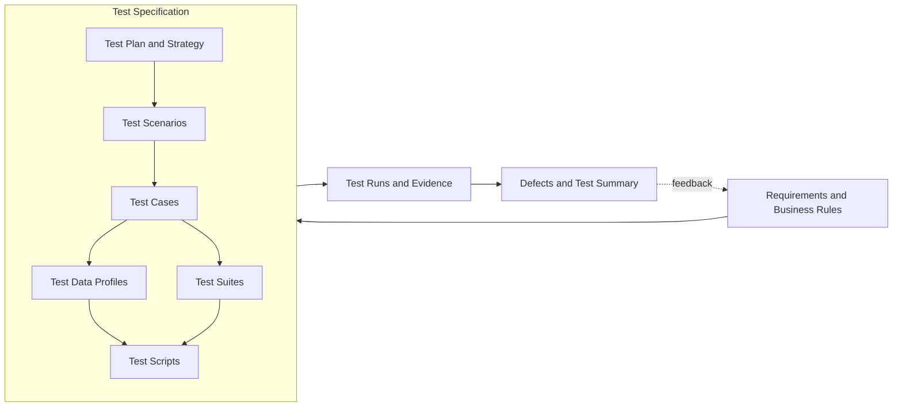
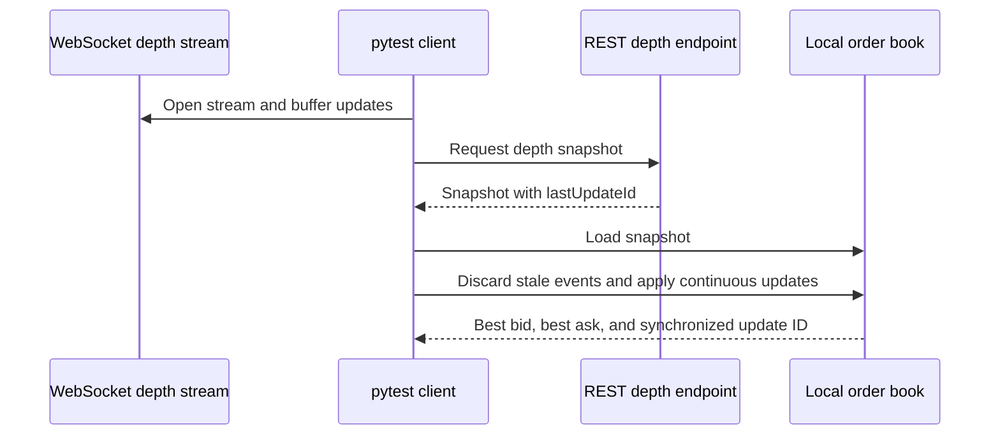

# CEX Market Data Quality Lab

[](https://github.com/sanyoii/cex-market-data-quality-lab/actions/workflows/tests.yml)

Status: reviewed revision based on `8fd5081`, authorized for commit and push. Check the commit's Actions run for public CI; historical receipts below retain their original revision boundaries.

2026-09-06 local review: corrected the employment attribution below and reran 40 deterministic and 5 live tests. See [the local review receipt](evidence/2026-09-06-local-review-run.md). The historical CI results below describe their recorded revisions; they are not a current-head CI claim.

This Python／pytest project validates Binance Spot public market data across REST snapshots and WebSocket updates. It focuses on failures that can silently corrupt a local order book: stale events, sequence gaps, invalid numeric values, crossed prices, mismatched control acknowledgments, and unbounded waits.

This personal portfolio project uses Binance public market-data APIs and is separate from my employment experience at BTSE. I use no API key, authentication, account data, order placement, or real funds.

## Verification at a glance

| State | Revision／source state | Evidence |
|---|---|---|
| Day 22 fresh local completion | Uncommitted candidate based on `8fd5081254b5429e480ec20a56ef09bcc6f5ab9e` | [40 deterministic and 5 live results passed locally on 2026-09-02](evidence/2026-09-02-day22-local-run.md); public CI/current-head live remains incomplete |
| Local governance candidate | Uncommitted governance and documentation changes based on `8fd5081254b5429e480ec20a56ef09bcc6f5ab9e` | [40 deterministic and 5 live results passed locally](evidence/2026-08-15-governance-candidate-run.md); public CI pending |
| Historical public deterministic | `8fd5081254b5429e480ec20a56ef09bcc6f5ab9e` | [Run 31823105148](https://github.com/sanyoii/cex-market-data-quality-lab/actions/runs/31823105148) passed 39 results on Python 3.12 and 3.14; live job skipped by push rules |
| Latest public live receipt | `9ce65e03b834c79c95bf2488c471be68cb7b1166` | [Run 31813561202](https://github.com/sanyoii/cex-market-data-quality-lab/actions/runs/31813561202) passed 5 live cases; this does not verify current head |

Reviewer path: read this table, inspect the [Traceability Matrix](docs/traceability-matrix.md), then open the [Test Run records](evidence/README.md). Human exploratory charters are designed but have not been executed.

## QA lifecycle



`Test Specification` is the container and index for the design artifacts. The Test Plan defines scope and execution strategy. `Test Data Profile` describes test inputs; the project avoids the ambiguous label `Test Profile` by itself.

| Lifecycle artifact | This project |
|---|---|
| Requirements | 9 project-local `REQ-*` IDs linked to official contracts or project policy |
| Test Plan | Scope, strategy, infrastructure, entry／exit criteria, priority, timeout, and retry policy |
| Test Scenarios | 9 system-level REST, WebSocket, synchronization, and evidence intents |
| Test Cases | 40 logical IDs with priority, preconditions, atomic actions, expected results, data, and suite |
| Test Data | 9 static, boundary, invalid, protocol, repository, and dynamic live profiles |
| Test Suites | Unit, REST contract, WebSocket contract, documentation contract, deterministic regression, and manually triggered live automation |
| Test Scripts | 3 production modules and 6 pytest modules with complete case-to-function mapping |
| Test Runs | Versioned local and GitHub-hosted results with JUnit artifacts |
| Summary | Release conclusion, limitations, and retained defect history |
| Manual testing | Human-executed plan, scenarios, suites, cases, procedures, evidence, and defect handling |

Canonical index: [Test Specification](docs/test-specification.md).

Manual path: [Manual QA Lifecycle](docs/manual-testing-lifecycle.md). Its status is Designed, not executed.

## Requirements and business rules

This portfolio repository has no Jira project. The repo uses stable project-local IDs instead of fabricated ticket keys.

| ID | Requirement and acceptance intent |
|---|---|
| REQ-SAFE-001 | Use public market-data interfaces only; no credentials, accounts, orders, or real funds. |
| REQ-REST-001 | Normalize and validate `bookTicker`; use `Decimal`, positive values, and `best bid <= best ask`. |
| REQ-REST-002 | Validate depth request parameters, update ID, levels, both sides, and market ordering. |
| REQ-REST-003 | Return a single requested symbol's status and filter types from `exchangeInfo`. |
| REQ-REST-004 | Preserve HTTP／exchange error details and the bounded REST timeout type. |
| REQ-WS-001 | Correlate subscribe／unsubscribe acknowledgments and bound every receive wait. |
| REQ-WS-002 | Validate event symbol, numbers, market ordering, and non-decreasing update IDs. |
| REQ-SYNC-001 | Discard stale events, apply continuous updates, delete zero-quantity levels, and stop before mutation on a sequence gap. |
| REQ-EVID-001 | Keep deterministic and live results separate and record revision, environment, result, limitations, and JUnit artifacts. |

Core business rules:

- Prices are positive. Snapshot quantities are positive; a diff-depth quantity of zero deletes that price level.
- A valid local book contains bids and asks and is not crossed.
- Stale events do not mutate state; a sequence gap stops synchronization before mutation.
- Live infrastructure failures remain Fail or Blocked live evidence and are never converted into deterministic PASS.
- Assertions are never retried. Any future infrastructure retry must disclose the original failure and attempt count.

Full sources and acceptance criteria: [Requirements and Business Rules](docs/requirements.md) and [Acceptance Criteria](docs/acceptance-criteria.md).

## Test Plan and strategy

### Scope

Included:

- Public REST `exchangeInfo`, `bookTicker`, and depth.
- Public WebSocket `bookTicker` and diff-depth streams.
- Order-book numeric, ordering, staleness, continuity, and deletion rules.
- Deterministic unit／contract tests and live integration tests with distinct labels.
- JUnit and versioned execution evidence.

Excluded:

- Authentication, accounts, balances, orders, matching-engine execution, deposits, withdrawals, wallets, chain confirmations, funding, liquidation, KYC, AML, UI, load, performance, penetration testing, and cross-exchange compatibility.
- Production reconnect／resynchronization loops.

### Test layers

| Layer | Results | Purpose | External network |
|---|---:|---|---|
| Unit | 12 | Order-book state transitions and invariants | No |
| REST contract | 11 | Request shape, parsing, schema failures, errors, cardinality, and timeout with `httpx.MockTransport` | No |
| WebSocket contract | 12 | Control, JSON／schema validation, ordering, synchronization, and timeout with fake connections | No |
| Documentation contract | 5 | Traceability, script mapping, links, public-only scope, and shared governance | No |
| Live integration | 5 | Current public REST／WebSocket compatibility | Yes |

The local governance candidate contains 40 deterministic results. Public head `8fd5081` passed 39 deterministic results on Python 3.12 and 3.14. Live automation runs only through `workflow_dispatch` on Python 3.14 and does not replace deterministic coverage.

### Entry criteria

- Identify the source revision and install declared dependencies.
- Keep deterministic I/O behind mocks／fakes.
- Use public endpoints only; configure no secret or trading permission.
- Require network availability before starting the live suite.

### Exit criteria

- All 40 deterministic results pass on Python 3.12 and 3.14 before publication.
- All requirements map to an executable case or explicit inspection gate.
- No known open S0／S1 defect remains in the published baseline.
- A publication verification records the five-case live result without hiding external failures.
- Retain JUnit artifacts and known limitations.

Full plan: [Test Plan and Strategy](docs/test-plan.md).

## Test Scenarios

| ID | Type | System-level intent | Requirements |
|---|---|---|---|
| SCN-001 | Positive／safety | Read a public symbol book ticker and reject unusable top-of-book data. | REQ-SAFE-001, REQ-REST-001 |
| SCN-002 | Positive／state | Request public depth and construct a valid local order-book snapshot. | REQ-REST-002, REQ-SYNC-001 |
| SCN-003 | Positive | Read exchange metadata needed to interpret a public symbol. | REQ-REST-003 |
| SCN-004 | Negative | Preserve a structured exchange error for diagnosis. | REQ-REST-004 |
| SCN-005 | Positive／protocol | Subscribe, validate stream events, and unsubscribe safely. | REQ-WS-001, REQ-WS-002 |
| SCN-006 | Negative | Reject malformed JSON, wrong shape, missing fields, wrong-symbol, invalid-number, crossed, or out-of-order events. | REQ-WS-002 |
| SCN-007 | Positive／state | Align a REST snapshot with buffered diff-depth events. | REQ-REST-002, REQ-SYNC-001 |
| SCN-008 | Negative／state | Detect stale events and sequence gaps without corrupting state. | REQ-SYNC-001 |
| SCN-009 | Evidence | Produce reproducible deterministic evidence and distinct live evidence. | REQ-EVID-001 |

[Test Scenarios](docs/test-scenarios.md) documents the service boundaries.

## Test Suites

| Suite | Purpose | Trigger | Setup／teardown |
|---|---|---|---|
| SUITE-UNIT | Twelve `OB-*` results | Local and CI | New in-memory book per case; no shared state |
| SUITE-REST-CONTRACT | Eleven `REST-*` results | Local and CI | Inject mock transport; close client after each case |
| SUITE-WS-CONTRACT | Twelve `WS-*` results | Local and CI | New fake message queue and async context per case |
| SUITE-DOC-CONTRACT | Five `DOC-*` results | Local and CI | Read-only parsing of repository contracts |
| SUITE-REGRESSION | All 40 deterministic results | Push, PR, `workflow_dispatch` | Fresh job per Python version; JUnit uploaded even on failure |
| SUITE-LIVE | Five `LIVE-*` cases | Manually triggered workflow only | New public client／connection per case; 30-second case timeout |

Cases are independent and have no required cross-case order. The workflow uses sequential pytest execution per job; deterministic cases retain case-local state so a parallel runner can isolate them. Full execution rules: [Test Suites](docs/test-suites.md).

## Test Cases

Priority is execution importance, not defect severity: P0 protects safety or state integrity; P1 covers core functional, contract, synchronization, traceability, or release-evidence behavior; P2 covers defensive edges; P3 is future or informational coverage.

Defects use a separate S0 Critical through S3 Low impact scale. The [Test Plan](docs/test-plan.md) defines both models.

<details>
<summary>Full logical case overview</summary>

| Case IDs | Priority focus | Behavior covered |
|---|---|---|
| OB-001 | P1 | Snapshot exposes highest bid and lowest ask as `Decimal` levels. |
| OB-002 | P0 | Continuous update adds levels and removes zero-quantity levels. |
| OB-003 | P0 | Stale event leaves update ID and visible state unchanged. |
| OB-004 | P0 | Sequence gap raises before state mutation. |
| OB-005 | P0 | The client rejects a crossed snapshot. |
| OB-006 | P0 | Snapshot plus buffered events forms synchronized state. |
| OB-007 | P0 | The client rejects zero／negative snapshot values through three parameter rows. |
| OB-008 | P0 | The client rejects a negative update quantity while zero remains a deletion signal. |
| OB-009 | P0 | The client rejects a snapshot with an empty bid or ask side. |
| REST-001 | P1 | Book ticker request normalization and `Decimal` parsing. |
| REST-002 | P0 | The REST client rejects a crossed ticker. |
| REST-003 | P1 | Depth symbol／limit request and snapshot validation. |
| REST-004 | P1 | The REST client preserves invalid-symbol status, code, and message. |
| REST-005 | P1 | The REST client returns the requested trading symbol and filter types. |
| REST-006 | P0 | The REST client rejects non-positive ticker fields. |
| REST-007 | P1 | `exchangeInfo` rejects zero or multiple symbol entries. |
| REST-008 | P1 | Missing fields and non-object ticker payloads produce a stable contract error. |
| REST-009 | P1 | A bounded REST transport timeout remains diagnosable as `httpx.ReadTimeout`. |
| WS-001 | P1 | Subscribe, validate, and unsubscribe lifecycle. |
| WS-002 | P0 | The WebSocket client rejects a decreasing update ID. |
| WS-003 | P1 | The WebSocket client rejects a wrong-symbol event. |
| WS-004 | P0 | The WebSocket client rejects a non-positive stream field. |
| WS-005 | P0 | The WebSocket client rejects a crossed stream event. |
| WS-006 | P1 | The WebSocket client rejects a wrong acknowledgment ID. |
| WS-007 | P1 | The WebSocket client tolerates an in-flight market event while waiting for unsubscribe acknowledgment. |
| WS-008 | P0 | Buffered stream and REST snapshot synchronize through continuous updates. |
| WS-009 | P1 | Slow receive stops at the configured timeout. |
| WS-010 | P1 | Malformed JSON produces a stable WebSocket contract error. |
| WS-011 | P1 | A non-object JSON payload is rejected. |
| WS-012 | P1 | A missing required ticker field produces a stable schema error. |
| DOC-001 | P1 | Requirement IDs match the traceability matrix. |
| DOC-002 | P1 | Every logical Case ID maps to an existing pytest function. |
| DOC-003 | P2 | Every relative Markdown link resolves. |
| DOC-004 | P0 | Configured interfaces remain inside the public market-data allowlist. |
| DOC-005 | P1 | Automated and manual documents share governance, statuses, and traceability. |
| LIVE-REST-001 | P1 | Current `exchangeInfo` symbol status and filters. |
| LIVE-REST-002 | P1 | Current public book-ticker invariants. |
| LIVE-REST-003 | P1 | Current public depth builds valid state. |
| LIVE-WS-001 | P1 | Three current ticker events are valid and ordered. |
| LIVE-SYNC-001 | P0 | Current REST snapshot and diff-depth stream synchronize. |

</details>

The catalog contains 40 logical IDs: 35 deterministic and 5 live. Parameterization expands the local governance candidate to 40 deterministic pytest results plus 5 live results. Preconditions, atomic actions, expected results, data, and suite assignment are in [Test Cases](docs/test-cases.md).

## Test Data Profiles

| Profile | Data class | Purpose |
|---|---|---|
| DATA-OB-VALID | Static valid | Positive decimal levels and non-crossed snapshots／events |
| DATA-OB-SEQUENCE | Static boundary | Stale, continuous, and gapped update-ID ranges |
| DATA-NUMERIC-INVALID | Static invalid | Zero, negative, and crossed-market values |
| DATA-REST-ERROR | Static invalid | Invalid symbol, HTTP 400, code `-1121`, and exchange message |
| DATA-WS-CONTROL | Static protocol | Matching／mismatched IDs and an in-flight market event |
| DATA-REST-CARDINALITY | Static boundary | Zero and multiple symbol entries in `exchangeInfo` |
| DATA-SCHEMA-INVALID | Static invalid | Missing fields, malformed JSON, arrays, and wrong payload shapes |
| DATA-REPO-METADATA | Static repository | Requirement IDs, Case IDs, script paths, Markdown links, endpoint defaults, and workflow text |
| DATA-LIVE-BTCUSDT | Dynamic live | Current `BTCUSDT` values, depth limit 100, and three stream events |

Each case recreates its synthetic data and uses reserved `.invalid` hosts. Live cases assert contracts and invariants, never a fixed market price. Full matrix and isolation rules: [Test Data Profiles](docs/test-data-profiles.md).

## Test Scripts

| Layer | Version-controlled path | Test seam／responsibility |
|---|---|---|
| Order-book logic | `src/cex_quality/order_book.py` | State transitions, stale／gap handling, deletion, and market invariants |
| REST adapter | `src/cex_quality/rest_client.py` | Request construction, `Decimal` parsing, error preservation, and validation |
| WebSocket adapter | `src/cex_quality/websocket_client.py` | Control acknowledgments, bounded receives, event validation, and synchronization |
| Unit scripts | `tests/unit/test_order_book.py` | `OB-*` cases |
| Contract scripts | `tests/contract/` | `REST-*` and `WS-*` cases through injected I/O |
| Live scripts | `tests/live/` | `LIVE-*` cases against public services |
| Documentation contract | `tests/meta/test_documentation_contract.py` | `DOC-*` mapping, link, and public-scope gates |

There is no UI and therefore no locator or Page Object Model. Injected protocol adapters are the test seams. Assertions use exact values, exception types／messages, request payloads, and market invariants. REST／WebSocket waits are explicit and bounded. The current workflow has no automatic retry.

Every Test Case ID maps to an exact pytest function in the [Automation Map](docs/automation-map.md).

## Requirements traceability

| Requirement | Scenarios | Cases／gate |
|---|---|---|
| REQ-SAFE-001 | SCN-001, SCN-009 | DOC-004 and all live cases |
| REQ-REST-001 | SCN-001 | REST-001, REST-002, REST-006, REST-008, LIVE-REST-002 |
| REQ-REST-002 | SCN-002, SCN-007 | REST-003, LIVE-REST-003, LIVE-SYNC-001 |
| REQ-REST-003 | SCN-003 | REST-005, REST-007, LIVE-REST-001 |
| REQ-REST-004 | SCN-004 | REST-004, REST-009 |
| REQ-WS-001 | SCN-005 | WS-001, WS-006, WS-007, WS-009, LIVE-WS-001 |
| REQ-WS-002 | SCN-005, SCN-006 | WS-001–WS-005, WS-010–WS-012, LIVE-WS-001 |
| REQ-SYNC-001 | SCN-002, SCN-007, SCN-008 | OB-001–OB-009, WS-008, LIVE-SYNC-001 |
| REQ-EVID-001 | SCN-009 | DOC-001–DOC-003, DOC-005, SUITE-REGRESSION, SUITE-LIVE, workflow, and evidence schema |

The matrix maps 9／9 requirements, 9／9 scenarios, and 40／40 logical Test Case IDs. Mapping strength is labeled Automated, Live, or Inspection in the full document. These are traceability counts, not source-code coverage. Full mapping: [Requirements Traceability Matrix](docs/traceability-matrix.md).

## Test Runs, evidence, and defects

| Run | Revision | Environment | Result | Artifacts |
|---|---|---|---|---|
| Local deterministic baseline | Uncommitted candidate recorded on 2026-08-14 | Windows, Python 3.14.2 | 25 passed | Local JUnit hash recorded |
| Previous local candidate | Uncommitted changes on `9ce65e03b834c79c95bf2488c471be68cb7b1166` | Windows, Python 3.14.2 | 39 deterministic and 5 live passed | [Local receipt](evidence/2026-08-15-local-candidate-run.md) |
| Local live | Same local candidate | Windows, Python 3.14.2 | 5 passed | Local JUnit hash recorded |
| Public deterministic | `b1397ef67a0b1d364a4d776c21effac6e4d452c1` | GitHub-hosted Ubuntu, Python 3.12／3.14 | 25 passed on each version | JUnit artifacts |
| Public live automation | Same implementation revision | GitHub-hosted Ubuntu, Python 3.14 | 5 passed | Manually triggered live JUnit artifact |
| Current public deterministic | `8fd5081254b5429e480ec20a56ef09bcc6f5ab9e` | GitHub-hosted Ubuntu, Python 3.12／3.14 | 39 passed on each version; live job skipped | [Current-head receipt](evidence/2026-08-15-current-head-ci-status.md) |
| Historical public live | `9ce65e03b834c79c95bf2488c471be68cb7b1166` | GitHub-hosted Ubuntu, Python 3.14 | 5 passed; not current-head evidence | [Run 31813561202](https://github.com/sanyoii/cex-market-data-quality-lab/actions/runs/31813561202) |

The first live unsubscribe run exposed one S2 Medium defect. The client misclassified a valid in-flight ticker that arrived before the acknowledgment, producing a false test failure without market-state corruption. The fix waits for the matching request ID, `WS-007` covers the ordering, and the evidence retains the original failure. Open known S0／S1 defects: 0.

- [Local execution record](evidence/2026-08-14-local-live-run.md)
- [Current local candidate record](evidence/2026-08-15-local-candidate-run.md)
- [Current governance candidate record](evidence/2026-08-15-governance-candidate-run.md)
- [Current-head public deterministic status](evidence/2026-08-15-current-head-ci-status.md)
- [Public CI and live verification](evidence/2026-08-14-public-ci-run.md)
- [Reusable Test Run template](evidence/TEMPLATE.md)
- [Test Summary Report](docs/test-summary-report.md)
- [Risks](docs/risk-analysis.md) and [limitations](docs/limitations.md)

## Data flow



## Run locally

PowerShell:

```powershell
python -m venv .venv
& '.\.venv\Scripts\python.exe' -m pip install -e '.[test]'
& '.\.venv\Scripts\python.exe' -m pytest tests/unit tests/contract tests/meta -v
& '.\.venv\Scripts\python.exe' -m pytest tests/live -v -m live
```

The deterministic command requires no network access. The live command calls public Binance services and can fail because of service availability, rate limits, DNS, regional policy, or runner network policy.

## Documentation map

- [Test Specification](docs/test-specification.md)
- [Requirements and Business Rules](docs/requirements.md)
- [Test Plan and Strategy](docs/test-plan.md)
- [Test Governance](docs/test-governance.md)
- [Test Scenarios](docs/test-scenarios.md)
- [Test Suites](docs/test-suites.md)
- [Test Cases](docs/test-cases.md)
- [Test Data Profiles](docs/test-data-profiles.md)
- [Automation Map](docs/automation-map.md)
- [Requirements Traceability Matrix](docs/traceability-matrix.md)
- [Manual QA Lifecycle](docs/manual-testing-lifecycle.md)
- [Exploratory Test Charters](docs/exploratory-charters.md)
- [Test Summary Report](docs/test-summary-report.md)
- [Test Run Evidence](evidence/README.md)

## External contracts

- [Binance Spot REST API](https://github.com/binance/binance-spot-api-docs/blob/master/rest-api.md)
- [Binance Spot WebSocket streams](https://github.com/binance/binance-spot-api-docs/blob/master/web-socket-streams.md)

The implementation follows the documented market-data-only endpoints and diff-depth update sequence. External documentation and live behavior can change; each live receipt records the date and observed result.
