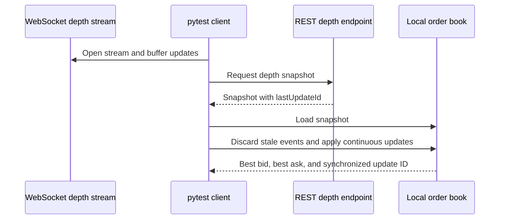

# CEX Market Data Quality Lab

Status: Publication candidate. Public repository and CI verification are pending.

This Python／pytest project checks Binance Spot public market data across REST snapshots and WebSocket updates. It focuses on contract failures that can corrupt a local order book: stale events, sequence gaps, invalid numeric values, crossed prices, and unbounded waits.

This is a personal portfolio project. It is not a Binance or BTSE work artifact.

## Scope

- Public REST market data from `https://data-api.binance.vision`.
- Public WebSocket market data from `wss://data-stream.binance.vision`.
- `BTCUSDT` by default; callers can pass another symbol.
- No API key, authentication, account data, order placement, or real funds.

## Data flow



## Checks

| Area | Behavior |
|---|---|
| REST contract | Symbol normalization, structured exchange errors, `Decimal` parsing, positive values, bid／ask ordering, depth validation, exchange filters |
| WebSocket contract | Subscribe／unsubscribe acknowledgement, symbol match, positive values, bid／ask ordering, non-decreasing update IDs, bounded receive timeout |
| Order-book state | Snapshot ordering, stale-event discard, sequence-gap detection, zero-quantity deletion, crossed-book rejection |
| Live integration | Public `exchangeInfo`, `bookTicker`, depth snapshot, book-ticker stream, REST snapshot plus diff-depth synchronization |

## Run locally

PowerShell:

```powershell
python -m venv .venv
& '.\.venv\Scripts\python.exe' -m pip install -e '.[test]'
& '.\.venv\Scripts\python.exe' -m pytest tests/unit tests/contract -v
& '.\.venv\Scripts\python.exe' -m pytest tests/live -v -m live
```

The deterministic command does not require network access. The live command calls Binance public services and can fail because of service availability, rate limits, DNS, regional policy, or runner network policy.

## Test evidence

- [Acceptance criteria](docs/acceptance-criteria.md)
- [Test cases](docs/test-cases.md)
- [Risk analysis](docs/risk-analysis.md)
- [Limitations](docs/limitations.md)
- Fresh execution records belong in [`evidence/`](evidence/README.md).

GitHub Actions runs deterministic tests on pushes and pull requests with Python 3.12 and 3.14. A manual workflow runs live tests. Both jobs retain JUnit XML even when tests fail.

## External contracts

- [Binance Spot REST API](https://github.com/binance/binance-spot-api-docs/blob/master/rest-api.md)
- [Binance Spot WebSocket streams](https://github.com/binance/binance-spot-api-docs/blob/master/web-socket-streams.md)

The implementation follows the documented market-data-only endpoints and diff-depth update sequence. External documentation and live behavior can change; each live receipt records the date and observed result.
