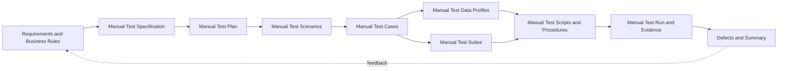

# Manual QA Lifecycle

Status: Designed, not executed. No `MTC-*` case has a human execution result.

I use this document to separate human observation from pytest automation. A tester must record the actual result and evidence during execution. The existing automated PASS records do not count as manual PASS evidence.



## 0. Manual Test Specification

This document is the canonical specification for the human-executed path.

| Artifact | Canonical section／file | Status |
|---|---|---|
| Requirements and business rules | [Canonical requirements](requirements.md) and section 1 | Active |
| Manual Test Plan | Section 2 | Designed |
| Manual Test Scenarios | Section 3 | Designed |
| Manual Test Suites | Section 4 | Designed |
| Manual Test Cases | Section 5 | Designed, 10 cases |
| Manual Test Data Profiles | Section 6 | Designed, 5 profiles |
| Manual Test Scripts and procedures | Section 7 | Designed |
| Manual Test Run | Section 8 and [Manual Test Run template](../evidence/MANUAL_TEMPLATE.md) | Not executed |
| Defects and summary | Section 9 | No manual defect record |

The Test Plan defines scope and controls. Scenarios capture system intent. Cases define observable checks. Suites group cases, while data profiles supply the inputs. Procedures tell the tester how to execute each case.

## 1. Requirements and business rules

The manual path reuses the canonical [requirements](requirements.md) instead of creating a second requirement set.

| Requirement | Manual verification intent |
|---|---|
| REQ-SAFE-001 | Confirm that the tester uses public market-data hosts, sends no credential, and performs no account or trading action. |
| REQ-REST-001 | Inspect one `bookTicker` response for symbol, positive bid／ask values, and `best bid <= best ask`. |
| REQ-REST-002 | Inspect a depth snapshot for update ID, non-empty sides, positive levels, and a non-crossed book. |
| REQ-REST-003 | Confirm that `exchangeInfo` returns one requested symbol, trading status, and core filters. |
| REQ-REST-004 | Confirm that an invalid symbol keeps HTTP status, exchange code, and exchange message visible. |
| REQ-WS-001 | Observe subscribe／unsubscribe acknowledgements, request IDs, event receipt, and bounded waiting. |
| REQ-WS-002 | Inspect stream events for symbol, required fields, positive values, market ordering, and non-decreasing update IDs. |
| REQ-SYNC-001 | Compare a depth snapshot with buffered diff-depth events and confirm the documented overlap sequence. |
| REQ-EVID-001 | Record tester, UTC time, revision, environment, steps, actual results, status, and evidence paths. |

Business rules `BR-001` through `BR-006` remain authoritative. A manual run must report an external outage as Fail or Blocked. The tester must not convert it into PASS.

## 2. Manual Test Plan

### Objective

Confirm that a human tester can inspect the public REST and WebSocket behavior, follow the synchronization sequence, and produce evidence that another reviewer can audit.

### Scope

Included:

- Public `exchangeInfo`, `bookTicker`, and depth REST requests.
- Public `bookTicker` and diff-depth WebSocket streams.
- Safety-boundary inspection, one invalid-symbol response, and evidence review.

Excluded:

- Authentication, balances, orders, deposits, withdrawals, KYC／AML, load, penetration testing, and real funds.
- Intentional rate-limit traffic, service disruption, and production reconnect certification.
- Schema mutation against the public service. Use local fixtures for destructive or malformed input checks.

### Environment and tools

| Item | Requirement |
|---|---|
| Source | Record the full Git SHA and branch. |
| REST client | Use an API client that shows URL, status, headers, and raw JSON. |
| WebSocket client | Use a client that shows connection URL, sent frames, received frames, and timestamps. |
| Symbol | Use `BTCUSDT` unless the run record names another public symbol. |
| Time | Record start and end in UTC. |
| Evidence | Save response bodies, frame logs, screenshots, and the completed run record outside ignored temporary storage. |
| Credentials | Configure none. Stop if the client adds an authorization header. |

### Entry criteria

- The tester records the revision and confirms a clean or disclosed worktree.
- The tester can reach the public market-data hosts.
- The REST and WebSocket clients show raw requests and responses.
- The tester creates a copy of the [Manual Test Run template](../evidence/MANUAL_TEMPLATE.md).

### Exit criteria

- All P0 and P1 manual cases have Pass, Fail, Blocked, or Skipped status with an actual result.
- No open S0 or S1 defect remains for a manual release recommendation.
- The run record includes evidence for each executed case and explains each missing artifact.
- The tester records external failures and does not hide them through retries.

## 3. Manual Test Scenarios

| ID | Scenario | Requirements | Boundary |
|---|---|---|---|
| MSCN-001 | Confirm the public-only safety boundary before sending requests. | REQ-SAFE-001 | Tester → client configuration → public hosts |
| MSCN-002 | Inspect public symbol metadata and top-of-book data. | REQ-REST-001, REQ-REST-003 | Tester → REST client → public REST |
| MSCN-003 | Inspect a valid depth snapshot and market ordering. | REQ-REST-002 | Tester → REST client → depth response |
| MSCN-004 | Preserve a structured invalid-symbol error. | REQ-REST-004 | Public REST → REST client → tester |
| MSCN-005 | Subscribe, inspect events, and unsubscribe with correlated IDs. | REQ-WS-001, REQ-WS-002 | Tester → WebSocket client → public stream |
| MSCN-006 | Align a snapshot with buffered diff-depth events. | REQ-REST-002, REQ-SYNC-001 | WebSocket buffer ↔ REST snapshot → worksheet |
| MSCN-007 | Produce an auditable manual Test Run record. | REQ-EVID-001 | Tester → evidence record → reviewer |

## 4. Manual Test Suites

| Suite | Purpose | Cases | Trigger | Setup／teardown |
|---|---|---|---|---|
| MSUITE-SMOKE | Confirm safe connectivity and core public responses. | MTC-SAFE-001, MTC-REST-001–MTC-REST-003 | Before a wider manual session | Clear client history; configure no credential; close sessions after capture |
| MSUITE-REST | Inspect success and error contracts. | MTC-REST-001–MTC-REST-004 | Release review or contract investigation | Use a new request tab per case; save raw response |
| MSUITE-WS | Inspect control frames and market events. | MTC-WS-001–MTC-WS-003 | Release review or stream investigation | Open a new connection; unsubscribe and close it after capture |
| MSUITE-SYNC | Rehearse the local-book overlap procedure. | MTC-SYNC-001 | Focused synchronization review | Start a new worksheet; discard captured market values after evidence storage |
| MSUITE-EVIDENCE | Review manual execution completeness. | MTC-EVID-001 | End of each session | Compare run record, artifacts, defects, and limitations |

The tester may run cases in suite order. Each case remains independent except `MTC-WS-002` and `MTC-WS-003`, which reuse the connection opened by `MTC-WS-001` within one recorded session.

## 5. Manual Test Cases

| ID | Priority | Preconditions／data | Manual steps | Expected result | Required evidence |
|---|---|---|---|---|---|
| MTC-SAFE-001 | P0 | API and WebSocket clients are open; MDATA-PUBLIC-SCOPE | 1. Inspect REST and WebSocket base URLs.<br>2. Inspect headers, variables, and client authentication settings.<br>3. Confirm that no account or order path is configured. | Hosts match the public allowlist. No credential, authorization header, account endpoint, or trading action exists. | Configuration screenshot or exported request with sensitive panes closed |
| MTC-REST-001 | P1 | MDATA-BTCUSDT | 1. Send `exchangeInfo` request.<br>2. Record status and JSON.<br>3. Locate the returned symbol, status, and filters. | HTTP 200; one `BTCUSDT` entry; status `TRADING`; `PRICE_FILTER` and `LOT_SIZE` present. | Request URL, status, and response body |
| MTC-REST-002 | P1 | MDATA-BTCUSDT | 1. Send `bookTicker` request.<br>2. Record bid／ask fields.<br>3. Compare numeric values. | HTTP 200; symbol matches; prices and quantities are positive; bid does not exceed ask. | Request URL, response body, and comparison note |
| MTC-REST-003 | P1 | MDATA-BTCUSDT; depth limit 100 | 1. Send depth request.<br>2. Record `lastUpdateId`.<br>3. Inspect both sides and their first level. | HTTP 200; positive update ID; non-empty bid／ask arrays; positive first levels; best bid does not exceed best ask. | Request URL, response body, and first-level calculation |
| MTC-REST-004 | P1 | MDATA-INVALID-SYMBOL | 1. Send a `bookTicker` request for `NOT_A_SYMBOL`.<br>2. Record status and body. | HTTP 400; exchange code `-1121`; message identifies an invalid symbol. | Request URL, status, and error body |
| MTC-WS-001 | P1 | MDATA-WS-BTCUSDT | 1. Connect to the public WebSocket host.<br>2. Send subscribe frame with ID 1.<br>3. Record the acknowledgement. | Connection opens; acknowledgement contains `result: null` and `id: 1`. | Connection URL, sent frame, acknowledgement, UTC timestamps |
| MTC-WS-002 | P1 | Active subscription from MTC-WS-001 | 1. Capture three `bookTicker` events.<br>2. Compare symbols, required fields, values, and update IDs. | All events use `BTCUSDT`; required fields exist; values are positive; bid does not exceed ask; update IDs do not decrease. | Three raw frames and a comparison worksheet |
| MTC-WS-003 | P1 | Active subscription after MTC-WS-002 | 1. Send unsubscribe frame with ID 2.<br>2. Wait within the declared session timeout.<br>3. Record frames until the matching acknowledgement. | A matching `id: 2` acknowledgement arrives. An in-flight market event does not count as an acknowledgement. | Sent frame, received frames, acknowledgement, elapsed time |
| MTC-SYNC-001 | P0 | MDATA-DEPTH-SYNC; REST and WebSocket clients | 1. Start the diff-depth stream and buffer events.<br>2. Request a depth snapshot.<br>3. Discard buffered events whose `u` is not newer than `lastUpdateId`.<br>4. Find the first event where `U <= lastUpdateId + 1 <= u`.<br>5. Apply three consecutive events in a worksheet.<br>6. Inspect the resulting top of book. | Event ranges overlap without a gap; zero quantities remove levels; the final book retains both sides and is not crossed. | Snapshot, buffered frames, worksheet, final best bid／ask |
| MTC-EVID-001 | P1 | Completed manual session | 1. Compare the run record with executed cases.<br>2. Open each evidence path.<br>3. Review defects, retries, warnings, and limitations. | Each executed case has status, actual result, and accessible evidence. Missing evidence blocks a manual PASS claim. | Completed run record and review sign-off |

## 6. Manual Test Data Profiles

| Profile | Type | Values／source | Used by | Isolation |
|---|---|---|---|---|
| MDATA-PUBLIC-SCOPE | Static configuration | REST `https://data-api.binance.vision`; WebSocket `wss://data-stream.binance.vision`; no credential | MTC-SAFE-001 | Inspect before each session |
| MDATA-BTCUSDT | Dynamic public | Symbol `BTCUSDT`; current market values | MTC-REST-001–MTC-REST-003 | Save one response per case; do not reuse prices as future expectations |
| MDATA-INVALID-SYMBOL | Static invalid | Symbol `NOT_A_SYMBOL` | MTC-REST-004 | One read-only public request |
| MDATA-WS-BTCUSDT | Dynamic public | Stream `btcusdt@bookTicker`; request IDs 1 and 2; three events | MTC-WS-001–MTC-WS-003 | Use one connection for the three linked cases, then close it |
| MDATA-DEPTH-SYNC | Dynamic public | Stream `btcusdt@depth`; depth limit 100; three applicable events | MTC-SYNC-001 | Use a new snapshot, buffer, and worksheet per run |

## 7. Manual Test Scripts and Procedures

### REST requests

Use an API client that preserves the raw response.

```text
GET https://data-api.binance.vision/api/v3/exchangeInfo?symbol=BTCUSDT
GET https://data-api.binance.vision/api/v3/ticker/bookTicker?symbol=BTCUSDT
GET https://data-api.binance.vision/api/v3/depth?symbol=BTCUSDT&limit=100
GET https://data-api.binance.vision/api/v3/ticker/bookTicker?symbol=NOT_A_SYMBOL
```

### WebSocket control frames

Connect to `wss://data-stream.binance.vision/ws` and send:

```json
{"method":"SUBSCRIBE","params":["btcusdt@bookTicker"],"id":1}
```

After three events, send:

```json
{"method":"UNSUBSCRIBE","params":["btcusdt@bookTicker"],"id":2}
```

Use `wss://data-stream.binance.vision/ws/btcusdt@depth` for `MTC-SYNC-001`. Record all frames used in the worksheet.

## 8. Manual Test Run

Create one [Manual Test Run record](../evidence/MANUAL_TEMPLATE.md) per session. Record:

- Tester, UTC start／end, branch, full revision, and worktree state.
- Tool names／versions, operating system, network condition, and public endpoints.
- Case status, actual result, evidence path, defect ID, retry count, and cleanup state.
- Session summary, known gaps, and release recommendation.

Allowed statuses are Pass, Fail, Blocked, and Skipped. A tester must write the actual result before assigning status.

## 9. Defects and summary

Use the S0 Critical through S3 Low severity model in the [Test Plan](test-plan.md). A defect record must include the failing Case ID, observed and expected results, reproducibility, environment, evidence, safety impact, owner, and current status.

The final manual summary must state:

- Cases planned, executed, passed, failed, blocked, and skipped.
- Open defects by severity and the release recommendation.
- Public-service conditions and coverage gaps.

## Manual coverage limits

- Human comparison can miss numeric or sequence errors that pytest catches. Use automation as the regression control.
- Public services do not provide safe malformed-schema injection. Use local fixtures for those negative checks.
- A short observation window does not prove reconnect behavior, rate-limit resilience, performance, or future service availability.
