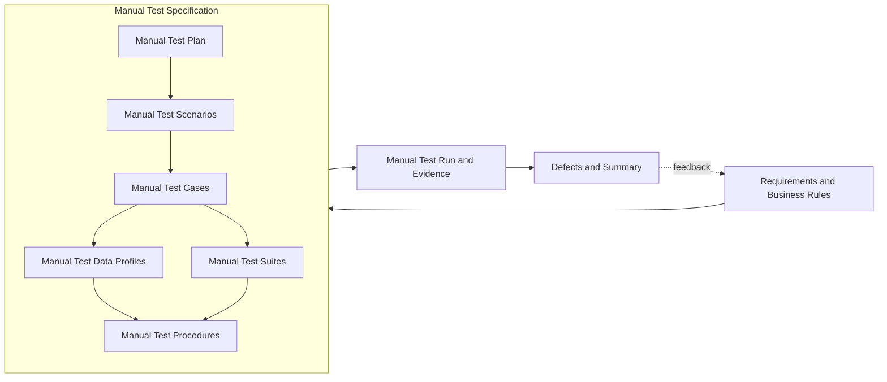

# Manual QA Lifecycle

Status: Designed, not executed. No `MTC-*` case has a human execution result.

I use this specification to separate human observation from pytest automation. A tester records the actual result and evidence during execution. Automated PASS records do not count as manual PASS evidence.



## 0. Manual Test Specification

`Manual Test Specification` is the container for the plan, scenarios, suites, cases, data profiles, procedures, and traceability. It is not a separate sequential test step.

| Artifact | Canonical section／file | Status |
|---|---|---|
| Requirements and business rules | [Canonical requirements](requirements.md) and section 1 | Active |
| Shared governance | [Test Governance](test-governance.md) and section 2 | Active |
| Manual Test Plan | Section 2 | Designed |
| Manual Test Scenarios | Section 3 | Designed, 7 scenarios |
| Manual Test Suites | Section 4 | Designed, 5 suites |
| Manual Test Cases | Section 5 | Designed, 11 cases |
| Manual Test Data Profiles | Section 6 | Designed, 7 profiles |
| Requirements Traceability Matrix | Section 7 | Designed, 9 requirements mapped |
| Manual Test Procedures | Section 8 | Designed |
| Manual Test Run | Section 9 and [Manual Test Run template](../evidence/MANUAL_TEMPLATE.md) | Not executed |
| Defects and summary | Section 10 | No manual defect record |

## 1. Requirements and business rules

The manual path reuses the canonical [requirements](requirements.md) instead of creating a second requirement set.

| Requirement | Manual verification intent |
|---|---|
| REQ-SAFE-001 | Confirm public market-data hosts, no credential, and no account or trading action. |
| REQ-REST-001 | Inspect one `bookTicker` response for required fields, positive values, and `best bid <= best ask`. |
| REQ-REST-002 | Inspect a depth snapshot for update ID, both sides, positive levels, and market ordering. |
| REQ-REST-003 | Confirm one requested symbol, trading status, and core filters in `exchangeInfo`. |
| REQ-REST-004 | Preserve HTTP status, exchange code, and message for an invalid symbol. |
| REQ-WS-001 | Observe subscribe／unsubscribe acknowledgments, correlated IDs, event receipt, and bounded waits. |
| REQ-WS-002 | Inspect symbol, required fields, positive values, market ordering, and update-ID order. |
| REQ-SYNC-001 | Compare a live depth snapshot with buffered events and separately rehearse zero-quantity deletion with a deterministic offline sample. |
| REQ-EVID-001 | Record tester, UTC time, revision, environment, expected and actual results, status, and evidence. |

Business rules `BR-001` through `BR-006` remain authoritative. A manual run reports an external outage as Fail or Blocked and does not convert it into PASS.

## 2. Manual Test Plan

### Objective and scope

Confirm that a human tester can inspect public REST and WebSocket behavior, follow the synchronization sequence, and produce evidence that another reviewer can audit.

Included: public `exchangeInfo`, `bookTicker`, and depth REST requests; public `bookTicker` and diff-depth WebSocket streams; safety-boundary inspection; one invalid-symbol response; synchronization rehearsal; evidence review.

Excluded: authentication, balances, orders, deposits, withdrawals, KYC／AML, real funds, intentional rate-limit traffic, service disruption, production reconnect certification, and destructive schema mutation against the public service.

### Environment and entry criteria

- Record the full Git SHA, branch, UTC start time, worktree state, clients, operating system, and client versions.
- Use clients that display raw URLs, headers, JSON, frames, and timestamps.
- Use `BTCUSDT` unless the run record declares another public symbol.
- Configure no credential. Stop if a client adds an authorization header.
- Copy the [Manual Test Run template](../evidence/MANUAL_TEMPLATE.md) before execution.
- Declare control-acknowledgment, event-receive, and case timeouts. Recommended values are 10, 10, and 30 seconds; record a reason for any change.

### Test priority

The canonical definitions are in [Test Governance](test-governance.md).

| Priority | Meaning | Release treatment |
|---|---|---|
| P0 | Safety boundary or state-corruption risk | Must pass |
| P1 | Core functional, contract, synchronization, traceability, or release-evidence behavior | Must pass |
| P2 | Defensive edge behavior with bounded impact | Must pass for regression baseline |
| P3 | Informational or future coverage | Does not block unless promoted |

### Defect severity

| Severity | Impact | Release treatment |
|---|---|---|
| S0 Critical | Safety boundary breach, real-fund exposure, or unrecoverable state corruption | Stop publication and correct before any rerun |
| S1 High | Core contract or synchronization failure with no safe workaround | Block publication |
| S2 Medium | Bounded incorrect behavior, false test result, or diagnosability gap with a safe workaround | Correct or document before baseline approval |
| S3 Low | Minor documentation or low-impact usability defect | Track without blocking the baseline |

### Exit and release criteria

- Map 100% of requirements to scenarios and cases.
- Execute and pass 100% of planned P0 and P1 cases for a release recommendation.
- Provide accessible evidence for 100% of executed cases.
- Keep zero open S0 or S1 defects.
- A required P0 or P1 Fail makes the run Failed and blocks release.
- With no required Fail, a required Blocked result makes the run Blocked with no release decision.
- With no required Fail or Blocked, a required Skipped or missing result makes the run Incomplete with no release decision.
- A run is Passed only when every required P0 and P1 case passes and all other gates are met.

## 3. Manual Test Scenarios

| ID | Type | Scenario | Requirements | Boundary |
|---|---|---|---|---|
| MSCN-001 | Safety | Confirm the public-only boundary before sending requests. | REQ-SAFE-001 | Tester → client configuration → public hosts |
| MSCN-002 | Positive | Inspect public symbol metadata and top-of-book data. | REQ-REST-001, REQ-REST-003 | Tester → REST client → public REST |
| MSCN-003 | Positive | Inspect a valid depth snapshot and market ordering. | REQ-REST-002 | Tester → REST client → depth response |
| MSCN-004 | Negative | Preserve a structured invalid-symbol error. | REQ-REST-004 | Public REST → REST client → tester |
| MSCN-005 | Positive／protocol | Subscribe, inspect events, and unsubscribe with correlated IDs. | REQ-WS-001, REQ-WS-002 | Tester → WebSocket client → public stream |
| MSCN-006 | Positive／state | Align a live snapshot with buffered diff-depth events and rehearse controlled local `OrderBook` deletion. | REQ-REST-002, REQ-SYNC-001 | WebSocket buffer ↔ REST snapshot → worksheet; deterministic local snapshot → `OrderBook` |
| MSCN-007 | Evidence | Produce an auditable manual Test Run record. | REQ-EVID-001 | Tester → evidence record → reviewer |

### Manual negative-coverage disposition

| Risk | Current owner | Manual coverage status |
|---|---|---|
| Schema drift and malformed payloads | Automated `REST-008`, `WS-010`–`WS-012` | `EXP-001` is designed, not executed. |
| Disconnect and resynchronization | Automated timeout and synchronization cases | `EXP-002` is designed, not executed. |
| Wrong or delayed acknowledgment | Automated `WS-006`, `WS-007`, `WS-009` | Manual cases cover the valid protocol path; no negative manual PASS is claimed. |
| Rate limit, DNS, and network-policy failures | Automated `REST-009` plus error-preservation contracts | `EXP-004` is designed, not executed. |

The [Exploratory Test Charters](exploratory-charters.md) own planned human negative exploration. The current manual specification does not claim those charters passed.

## 4. Manual Test Suites

| Suite | Purpose | Cases | Trigger | Setup／teardown |
|---|---|---|---|---|
| MSUITE-SMOKE | Confirm safe connectivity and core public responses. | MTC-SAFE-001, MTC-REST-001–MTC-REST-003 | Before a wider session | Clear history; configure no credential; close sessions after capture |
| MSUITE-REST | Inspect success and error contracts. | MTC-REST-001–MTC-REST-004 | Release review | Use a new request tab per case; save raw response |
| MSUITE-WS | Inspect control frames and market events. | MTC-WS-001–MTC-WS-003 | Release review | Open a new connection; unsubscribe and close it after capture |
| MSUITE-SYNC | Rehearse live snapshot alignment and controlled local-book deletion. | MTC-SYNC-001, MTC-SYNC-002 | Synchronization review | Start a new worksheet; retain live and offline evidence separately |
| MSUITE-EVIDENCE | Review execution completeness. | MTC-EVID-001 | End of session | Compare run record, artifacts, defects, and limitations |

Cases remain independent except `MTC-WS-002` and `MTC-WS-003`, which reuse the connection opened by `MTC-WS-001` in one recorded session.

## 5. Manual Test Cases

下表為案例索引；實際執行請從 §5.1 開始，再按各案例的逐步表操作。2026-09-08 修訂：補齊操作程序，尚未由人工依新版走讀，不能視為可用性驗收或測試 PASS。

| ID | Title／component | Priority | Requirement／scenario | Preconditions／data | Manual steps | Expected result | Required evidence |
|---|---|---|---|---|---|---|---|
| MTC-SAFE-001 | Public-scope safety gate | P0 | REQ-SAFE-001／MSCN-001 | API and WebSocket clients; MDATA-PUBLIC-SCOPE | 1. Inspect base URLs.<br>2. Inspect headers, variables, and authentication settings.<br>3. Confirm no account or order path. | Hosts match the public allowlist. No credential, authorization header, account endpoint, or trading action exists. | Configuration screenshot or exported request with sensitive panes closed |
| MTC-REST-001 | Exchange metadata | P1 | REQ-REST-003／MSCN-002 | MDATA-BTCUSDT | 1. Send `exchangeInfo`.<br>2. Record status and JSON.<br>3. Locate symbol, status, and filters. | HTTP 200; one `BTCUSDT`; status `TRADING`; `PRICE_FILTER` and `LOT_SIZE` present. | URL, status, and response body |
| MTC-REST-002 | Top of book | P1 | REQ-REST-001／MSCN-002 | MDATA-BTCUSDT | 1. Send `bookTicker`.<br>2. Record bid／ask fields.<br>3. Compare numeric values. | HTTP 200; symbol matches; values are positive; bid does not exceed ask. | URL, response body, and comparison note |
| MTC-REST-003 | Depth snapshot | P1 | REQ-REST-002／MSCN-003 | MDATA-BTCUSDT; limit 100 | 1. Send depth request.<br>2. Record `lastUpdateId`.<br>3. Inspect both sides and first levels. | HTTP 200; positive update ID; non-empty sides; positive levels; best bid does not exceed best ask. | URL, response body, and first-level calculation |
| MTC-REST-004 | Invalid symbol | P1 | REQ-REST-004／MSCN-004 | MDATA-INVALID-SYMBOL | 1. Request `NOT_A_SYMBOL`.<br>2. Record status and body. | HTTP 400; code `-1121`; message identifies an invalid symbol. | URL, status, and error body |
| MTC-WS-001 | Subscribe acknowledgment | P1 | REQ-WS-001／MSCN-005 | MDATA-WS-BTCUSDT | 1. Connect to the public host.<br>2. Send subscribe ID 1.<br>3. Record acknowledgment. | Connection opens; acknowledgment has `result: null` and `id: 1`. | URL, sent frame, acknowledgment, UTC timestamps |
| MTC-WS-002 | Market event inspection | P1 | REQ-WS-002／MSCN-005 | Active MTC-WS-001 subscription | 1. Capture three events.<br>2. Compare symbols, fields, values, and update IDs. | All use `BTCUSDT`; required fields exist; values are positive; bid does not exceed ask; update IDs do not decrease. | Three frames and comparison worksheet |
| MTC-WS-003 | Unsubscribe acknowledgment | P1 | REQ-WS-001／MSCN-005 | Active subscription; declared acknowledgment timeout | 1. Send unsubscribe ID 2.<br>2. Wait within the declared acknowledgment timeout.<br>3. Record frames until the matching acknowledgment. | A matching `id: 2` acknowledgment arrives. An in-flight market event does not count as acknowledgment. | Sent and received frames, acknowledgment, elapsed time |
| MTC-SYNC-001 | Live snapshot and stream alignment | P0 | REQ-REST-002, REQ-SYNC-001／MSCN-006 | MDATA-DEPTH-SYNC; REST and WebSocket clients | 1. Buffer diff-depth events.<br>2. Request snapshot.<br>3. Discard stale events.<br>4. Find the overlap event.<br>5. Apply three continuous events.<br>6. Inspect top of book. | Ranges overlap without a gap; updates are applied as replacements; final book has both sides and is not crossed. A live deletion is not required for this case. | Snapshot, frames, worksheet, final bid／ask |
| MTC-SYNC-002 | Controlled zero-quantity deletion | P0 | REQ-SYNC-001／MSCN-006 | MDATA-DEPTH-SYNC-CONTROLLED; local Python environment; no network | 1. Prepare a run record from [README](../README.md) and PRE-01–04, without opening Postman.<br>2. Open Git Bash at the repository root.<br>3. Run the deterministic snippet in §5.11.<br>4. Compare printed before／after bid and ask levels with the declared expected values; record the human result.<br>5. Save stdout and clean up transient state. | The existing best bid is removed by quantity `0`; the next bid remains; best ask remains `('101', '3')`; both sides remain and update ID advances. The snippet is an offline rehearsal, not a human PASS claim for the public stream. | Command, output, source revision, and human observation record |
| MTC-EVID-001 | Run evidence review | P1 | REQ-EVID-001／MSCN-007 | MDATA-MANUAL-RUN; completed session | 1. Compare run record with cases.<br>2. Open each evidence path.<br>3. Review defects, retries, warnings, and limitations. | Each executed case has expected and actual results, status, accessible evidence, and retry／cleanup records. Missing required evidence blocks PASS. | Completed run record and reviewer sign-off |

### 5.1 共用準備：第一次執行從這裡開始

操作基準為 **Postman Desktop**（HTTP 與 WebSocket request），另備文字編輯器、可保留完整小數的試算表及計時器。不是瀏覽器直接開 API 網址，也不使用 pytest 代替人工判讀。先確認電腦有這些工具並記錄版本；缺少工具時標記 Blocked，不要求測試者自行猜替代操作。本文依官方文件編寫，尚未核對本機 Postman UI；若找不到指定控制項，保留版本與畫面並回報程序缺口。

| 步驟 | 測試者要做的事 | 完成條件／紀錄 |
|---|---|---|
| PRE-01 | 在檔案總管開啟本專案 `cex-market-data-quality-lab`，進入 `evidence`，建立 `manual` 資料夾（已存在就直接使用）。其下建立本次專用資料夾，例如 `2026-09-08T090000Z-tester-attempt1`；時間改成本次 UTC、tester 改成姓名。 | 不覆寫舊 run。後文「run 資料夾」均指此目錄。 |
| PRE-02 | 將 `evidence/MANUAL_TEMPLATE.md` 複製到 run 資料夾並命名 `README.md`，用文字編輯器打開。 | 填 tester、reviewer（未指派填 pending）、UTC 開始時間、OS、工具版本。 |
| PRE-03 | 在專案根目錄的終端機依序執行 `git rev-parse HEAD`、`git branch --show-current`、`git status --short`，將輸出記到 README 的 revision、branch、worktree 欄。 | SHA 為完整值；dirty 檔案照實記錄，不清除修改。指令失敗則保存錯誤，先解決身分紀錄缺口。 |
| PRE-04 | 在 README 宣告本次計時：ack 10 秒、單次等事件 10 秒；REST／WS 收集每案 30 秒。SAFE、EVID 各 10 分鐘；SYNC 收集 30 秒、離線計算 30 分鐘。 | 這些是本程序的起始時間預算，後三項比原建議長，原因為人工檢查／計算。時間不夠記錄實際停止點，不默默延長或重試。 |
| PRE-05 | 開啟 Postman Desktop，建立全新獨立 request，不從已有 credentials 的 collection 複製；environment 選 `No environment`。不要在這次 request 使用 `{{variable}}`、scripts 或 inherited auth。 | URL 與輸入值都能直接看見；不改動既有工作用 request。 |
| PRE-06 | 在 run 資料夾建立 `observations.md`，每個案例建立「步驟、UTC、實際值、Pass/Fail/Blocked、證據檔名」表。 | 每步先保留預期條件，再填觀察值；未觀察不能填 Pass。 |

**HTTP 共用操作 H（每個 REST 案例都做一次）：** Postman 選 `New` → `HTTP`，method 選 `GET`，將案例提供的完整 URL 貼入 URL 欄。`Authorization` 選 `No Auth`；`Body` 選 `none`；`Headers` 不填自訂 header，檢查自動產生的 headers 也沒有 `Authorization`、`X-MBX-APIKEY` 或 Cookie。停用該 request 的自動 redirect 與 cookie jar（若本機版本無此控制，先停止並核對工具操作）。送出前完成 SAFE gate。按一次 `Send` 並開始計時；30 秒仍未返回就 `Cancel` 並記錄經過時間。回應區記下 HTTP status，將完整 JSON 複製存成案例指定的 `.json`；另存包含 URL、status、時間的截圖。不要把只截到第一屏的圖片當完整 response。

**每案收尾 C：** 將比較計算寫入 observations，README 填 expected、actual、status、evidence path、retry=0 與 cleanup。預期矛盾是 Fail；工具／網路／資料前提不足而無法判讀是 Blocked，寫清原因；刻意不做是 Skipped。保存失敗原始資料，不重送直到成功；後續 infrastructure retry 必須另記 attempt。REST 保留證據後關閉本次 tab；WS 依下文先退訂再 Disconnect，異常時直接 Disconnect 並記錄清理原因。

### 5.2 MTC-SAFE-001 — 公開介面與安全範圍確認（P0）

前置：PRE-01–06 完成。**本案只設定與檢查，尚不按 Send／Connect。**

| 步驟 | 操作 | 預期結果／保存資料 |
|---|---|---|
| 1 | 選 `New` → `HTTP`，method 選 GET，貼上 `https://data-api.binance.vision/api/v3/exchangeInfo?symbol=BTCUSDT`。 | scheme 是 `https`；host 完整等於 `data-api.binance.vision`，不是只包含相同文字的其他網域。 |
| 2 | 檢查 URL 中 host 後的 path 與 `Params`。本次 HTTP 僅允許 `/api/v3/exchangeInfo`、`/api/v3/ticker/bookTicker`、`/api/v3/depth`；參數只用案例列出的 symbol 與 limit。 | 此 request 是 `/api/v3/exchangeInfo`，symbol=`BTCUSDT`；沒有 account、order、balance 等其他 path，也沒有 apiKey、signature 或 token 參數。 |
| 3 | 開 `Authorization`，明選 `No Auth`；開 `Headers`（含自動 headers），逐列檢查；開 `Body` 選 none。 | 沒有 Authorization、X-MBX-APIKEY、Cookie 或其他 credentials。若發現憑證，停止，不將其值截入證據。 |
| 4 | 確認 environment 為 `No environment`、URL 無 `{{...}}`；查看 request 的 scripts 頁，確認 pre-request／post-response 皆空；確認無 collection 繼承設定。 | 請求送出前不會被變數或 script 改寫；新 request 無隱藏 authentication。 |
| 5 | 新建 `New` → `WebSocket`（不是 Socket.IO），URL 貼上 `wss://data-stream.binance.vision/ws`。查看 Headers、Params，保持無自訂內容；不要按 Connect。 | scheme=`wss`，host=`data-stream.binance.vision`，path=`/ws`；無 token、listenKey、帳戶參數或 credentials。 |
| 6 | 對照本程序剩餘的 HTTP URLs 與 WS 訊息：只有公開 GET、SUBSCRIBE／UNSUBSCRIBE，以及 bookTicker／depth stream。 | 找不到下單、餘額、帳戶或資金操作。不要用「試送敏感 endpoint」來驗證安全界線。 |
| 7 | 保存 HTTP URL／No Auth／headers 及 WS URL／headers 畫面為 `MTC-SAFE-001-http.png`、`MTC-SAFE-001-ws.png`，必要時增加截圖。執行收尾 C，但可保留已檢查的 tab 給下一案。 | observations 逐項列出 host、path、method、auth 檢查結果；全部符合才 Pass。任何設定變更後，送出前重新做本 gate。 |

### 5.3 MTC-REST-001 — Exchange metadata（P1）

前置：SAFE Pass；套用 HTTP 共用操作 H。

| 步驟 | 操作 | 預期結果／保存資料 |
|---|---|---|
| 1 | 在全新 GET request 貼上 `https://data-api.binance.vision/api/v3/exchangeInfo?symbol=BTCUSDT`，核對 No Auth 後按一次 Send。 | HTTP 200；記下 UTC 與 HTTP status。 |
| 2 | 在 JSON 找 `symbols` 陣列，數元素數量；展開唯一元素，讀 `symbol` 與 `status`。 | 陣列只有一個元素；`symbol`=`BTCUSDT`、`status`=`TRADING`。不是靠搜尋整個 response 出現 BTCUSDT 就算通過。 |
| 3 | 展開該元素的 `filters`，逐列找 `filterType`。 | 至少有 `PRICE_FILTER` 與 `LOT_SIZE`；將兩個物件的實際內容記到 observations。 |
| 4 | 保存 `MTC-REST-001-response.json` 與 `MTC-REST-001-http.png`，執行收尾 C。 | 證據可看見完整 filters、status、URL；不把 API 目前值當永久常數。 |

### 5.4 MTC-REST-002 — Top of book（P1）

前置：SAFE Pass；套用 H。

| 步驟 | 操作 | 預期結果／保存資料 |
|---|---|---|
| 1 | GET `https://data-api.binance.vision/api/v3/ticker/bookTicker?symbol=BTCUSDT`，按一次 Send。 | HTTP 200，`symbol`=`BTCUSDT`。 |
| 2 | 將 `bidPrice`、`bidQty`、`askPrice`、`askQty` 原始字串抄入 observations，各轉成十進位數值比較。 | 四欄都存在、可解析且各自大於 0；不要用字串字母順序比較。 |
| 3 | 在 observations 寫出本次 `bidPrice ≤ askPrice` 的實際數字與結果。 | 關係成立。只比較同一個 response；不要拿另一時刻的網站價格判 Fail。 |
| 4 | 保存 `MTC-REST-002-response.json`、`MTC-REST-002-http.png`，執行 C。 | 計算與原始 JSON 一一對得上。 |

### 5.5 MTC-REST-003 — Depth snapshot（P1）

前置：SAFE Pass；套用 H；試算表可保存價格／數量的完整精度。

| 步驟 | 操作 | 預期結果／保存資料 |
|---|---|---|
| 1 | GET `https://data-api.binance.vision/api/v3/depth?symbol=BTCUSDT&limit=100`。 | HTTP 200；`lastUpdateId` 為正整數。 |
| 2 | 找 `bids`、`asks`，將每個 `[price, quantity]` 分成 side、原始 price、原始 quantity、數值 price、數值 quantity 五欄，存試算表。 | 兩側都至少一列；逐列檢查 price > 0、quantity > 0。不能只看第一檔就宣稱所有 levels 正確。 |
| 3 | 檢查 bids 價格由高到低、asks 由低到高；找最高 bid 與最低 ask，列出比較值。 | 最高 bid ≤ 最低 ask；原始陣列的第一檔對應各側最佳價格。 |
| 4 | 保存 `MTC-REST-003-response.json`、`MTC-REST-003-http.png`、`MTC-REST-003-levels.xlsx`（其他試算表格式需記錄），執行 C。 | 保存原始小數與計算，不用畫面四捨五入後的數值判定。 |

### 5.6 MTC-REST-004 — Invalid symbol（P1）

前置：SAFE Pass；套用 H。這是一筆有意的無效輸入，不是要求系統成功回傳行情。

| 步驟 | 操作 | 預期結果／保存資料 |
|---|---|---|
| 1 | GET `https://data-api.binance.vision/api/v3/ticker/bookTicker?symbol=NOT_A_SYMBOL`，只送一次。 | HTTP 400；不是期待 HTTP 200。 |
| 2 | 在 error JSON 找 `code`、`msg`，原樣抄入 observations。 | `code` 為 `-1121`；`msg` 指出 invalid symbol。若是 403／451、網路錯誤或 HTML 擋頁，保存實際內容並標 Blocked，不能當作本案預期錯誤通過。 |
| 3 | 保存 `MTC-REST-004-error.json`、`MTC-REST-004-http.png`，執行 C。 | URL、HTTP status、exchange code、message 都可查閱。 |

### 5.7 MTC-WS-001 — Subscribe acknowledgment（P1）

前置：SAFE Pass；全新 WebSocket tab。以下 JSON 可直接複製，請勿改用 Socket.IO。

| 步驟 | 操作 | 預期結果／保存資料 |
|---|---|---|
| 1 | 選 `New` → `WebSocket`，URL 填 `wss://data-stream.binance.vision/ws`。核對 Headers 無 credentials 後按 Connect，開始計時。 | 10 秒內連線成功；若失敗保存錯誤與經過時間，不繼續假裝已有連線。 |
| 2 | 在訊息輸入框貼入 `{"method":"SUBSCRIBE","params":["btcusdt@bookTicker"],"id":1}`，按 Send；記錄送出 UTC。 | Messages 區有一筆 outgoing frame；內容與 id 正確。 |
| 3 | 開啟收到的各筆訊息，尋找 `{"result":null,"id":1}`，從送出時計算不超過 10 秒。 | 匹配 id 且 result 為 null；行情訊息即使先到，也不是 acknowledgment。逾時保留所有 frames 與實際經過時間。 |
| 4 | 將 outgoing 與 ack 完整內容連同方向、UTC 複製到 `MTC-WS-001-frames.txt`，保存 Messages 畫面。 | 保留連線，立刻接 WS-002、WS-003；README 註記 cleanup deferred to WS-003。若不接續，執行 WS-003 的退訂／斷線操作作為清理，不自動給 WS-003 Pass。 |

### 5.8 MTC-WS-002 — Market event inspection（P1）

前置：同一 run 的 WS-001 已 Pass、連線仍開啟。若連線中斷，標 Blocked，不悄悄重建後沿用舊證據。

| 步驟 | 操作 | 預期結果／保存資料 |
|---|---|---|
| 1 | 從 Messages 依接收時間擷取三筆連續行情事件；略過 ack，但不挑選只看起來正確的事件。每筆最多等待 10 秒，總收集不超過 30 秒。 | 取得三筆完整 JSON；不足三筆要記錄缺多少與 timeout，不用重複一筆湊數。 |
| 2 | 將每筆的 `s`（symbol）、`u`（update ID）、`b`（bid price）、`B`（bid quantity）、`a`（ask price）、`A`（ask quantity）填入比較表。 | 六欄皆存在；`s`=`BTCUSDT`；四個價量為可解析正數；u 是整數。 |
| 3 | 每列算 `b ≤ a`，再按接收順序比較 `u1 ≤ u2 ≤ u3`。 | 三列皆不 crossed，update ID 不倒退；不要求每筆恰好加一，也不要求三筆價格相同。 |
| 4 | 保存 `MTC-WS-002-frames.txt`（每筆附 UTC）與比較表 `MTC-WS-002-comparison.md`，填入 C 的結果欄。 | 保留同一連線給 WS-003，cleanup 暫記 deferred。 |

### 5.9 MTC-WS-003 — Unsubscribe acknowledgment（P1）

前置：WS-001 的訂閱仍有效。

| 步驟 | 操作 | 預期結果／保存資料 |
|---|---|---|
| 1 | 在同一訊息框貼上 `{"method":"UNSUBSCRIBE","params":["btcusdt@bookTicker"],"id":2}`，按 Send 並記送出 UTC。 | outgoing frame 為 UNSUBSCRIBE、相同 stream、id=2。 |
| 2 | 逐筆查看後續收到的 frames，直到 `result:null`、`id:2`，或等滿 10 秒。 | 10 秒內有 matching ack；in-flight 行情 frame 不是 ack，也不因收到一筆行情就立即 Fail。 |
| 3 | 保存送出、途中收到的 frames、ack 與時間到 `MTC-WS-003-frames.txt`；寫下 ack UTC 減送出 UTC 的秒數。 | 有可核對的 timeout 判斷；沒有 ack 就不能填 Pass。 |
| 4 | 按 Disconnect，確認顯示斷線；填入 C，並更新 WS-001／002 的 cleanup 為 completed by WS-003。 | 不留背景 socket。這個案例只驗證退訂 ack，沒有宣稱永久不再收到事件或完成長連線測試。 |

### 5.10 MTC-SYNC-001 — Snapshot and stream alignment（P0）

前置：SAFE Pass；新 WS 連線；HTTP snapshot request 預先設定好但未送出；準備試算表。先收集後離線計算，不嘗試一邊手算一邊追上即時行情。

| 步驟 | 操作 | 預期結果／保存資料 |
|---|---|---|
| 1 | 新建 WebSocket，URL=`wss://data-stream.binance.vision/ws`，Connect 後送 `{"method":"SUBSCRIBE","params":["btcusdt@depth@100ms"],"id":11}`。 | 10 秒內收到 `result:null,id:11`；Messages 持續保留接收記錄，不清除。 |
| 2 | 收到第一筆 `e=depthUpdate` 的事件後，保留完整 JSON、接收 UTC、`U`（起始 ID）、`u`（結束 ID）。立即在準備好的 HTTP tab 送 GET `https://data-api.binance.vision/api/v3/depth?symbol=BTCUSDT&limit=100`。 | 先開始 stream 才取 snapshot；HTTP 200，保存 snapshot 與 `lastUpdateId`，命名為 L。 |
| 3 | snapshot 返回後再收集 3 秒的 depth events（全部收集階段上限 30 秒），送 `{"method":"UNSUBSCRIBE","params":["btcusdt@depth@100ms"],"id":12}`；記 ack 後 Disconnect。 | 保存從第一筆至斷線的所有 frames（含控制訊息與 UTC）為 `MTC-SYNC-001-frames.txt`；snapshot 存 `MTC-SYNC-001-snapshot.json`。若 UI 無法保留完整序列，標 Blocked，不手挑三筆代替完整 buffer。 |
| 4 | 試算表建立 Events 表：接收序號、U、u、s、處理決定、處理前 local ID、處理後 local ID。逐筆填 depth events，不填 ack；確認 s=BTCUSDT。 | 可依接收順序追溯每個 ID；不先排序 IDs 來掩蓋亂序。 |
| 5 | 比較 L 與第一筆的 U。若 L 小於第一筆 U，標記此次資料無法按本程序銜接，保存後停止；重新收集須另記 attempt。否則把 u ≤ L 的事件逐筆標 stale，不套用。 | 第一筆保留事件須滿足 `U ≤ L+1 ≤ u`；若 U > L+1，存在 gap，不能继续修改本地 book。 |
| 6 | 建立 Book 表，將 snapshot 所有 bids／asks 各拆成 side、price、quantity；以 side+數值 price 為唯一 key。初始 local ID=L。 | 保留所有初始 levels 與完整小數；bids 和 asks 同價仍是兩個不同 key。 |
| 7 | 從第一筆保留事件起，依序處理。每次先檢查：u ≤ local ID 就略過；U > local ID+1 就停止並記 gap；其餘才可套用。 | 在改數量前完成連續性判斷；每次記錄處理前 ID 與 U/u。若 sequence gap 來自不完整擷取，為 Blocked；若完整證據證明預期被違反，記 Fail 並保留原始序列。 |
| 8 | 對事件的 b（買方更新）、a（賣方更新）每個 `[price,quantity]` 逐列操作：quantity>0 時新增或**取代**同側同價數量；quantity=0 時刪除該側該價位，原本不存在則記 no-op。 | 數量不是加減量。另建 Changes 表記 event ID、side、price、old quantity、new quantity、insert/replace/delete/no-op；完成整個事件後才將 local ID 更新為 u。 |
| 9 | 套用三筆有效連續事件，每筆套完記錄最高 bid、最低 ask；將最終 Book 與 Changes 保存為 `MTC-SYNC-001-worksheet.xlsx`。 | 每次兩側非空且 best bid ≤ best ask。若有限的 100 檔資料不足以判斷最佳價格，記 Blocked／coverage gap，不宣稱完整市場深度正確。 |
| 10 | 保存 snapshot、所有 frames、worksheet、HTTP／WS 截圖；填入 C。 | 明列套用的三筆 ID、capture 與 review 時間。這是人工同步演練，不是 Python client、完整深度或 production reconnect 認證；本案不要求 live zero-quantity event。 |

離線理解範例（**不是執行證據**）：local ID=100、事件 U=101/u=102，可套用並更新為 102；下一筆 U=105/u=106 則有 gap。某價格原数量=2，事件 quantity=3 是改成 3，不是變 5；下一筆 quantity=0 才刪除該 level。

### 5.11 MTC-SYNC-002 — Controlled zero-quantity deletion（P0）

前置：已安裝本專案依賴；從 repository root 使用 Git Bash；不需要網路、API credentials 或 SAFE network gate。這個案例驗證本機 `OrderBook` API 對完整 snapshot 與單一 update 的判讀，不能替代 live synchronization，也不能把程式輸出直接當成人工 Pass。

| 步驟 | 測試者要做的事 | 完成條件／紀錄 |
|---|---|---|
| 1 | 依 [README](../README.md) 的專案設定完成依賴，並依 PRE-01–04 建立 run record、記錄 revision／環境／時間；本案不開 Postman。 | run record 可追溯，且明確記錄 no-network precondition。 |
| 2 | 從 repository root 開啟 Git Bash，確認目前目錄與 `src`、`.venv/Scripts/python.exe` 存在。 | 路徑確認寫入 observations；缺少依賴標 Blocked。 |
| 3 | 執行下方 deterministic snippet，不修改 source、snapshot 或 event。 | stdout 完整保存；沒有網路連線或 persistent state。 |
| 4 | 對照 declared expected 與實際 before／after bid、ask、`changed`、`update_id`，將人工結果填入 observations。 | 數值逐項相符才可記錄觀察結果；不要把程式輸出直接當人工 Pass。 |
| 5 | 將 command、stdout、revision 與觀察存成 `MTC-SYNC-002-offline-output.txt`；程式結束即釋放記憶體中的 book，記錄 cleanup not required（未產生暫存狀態）。 | Evidence path 可開啟；若未能執行記錄 Blocked。 |

```bash
PYTHONPATH=src .venv/Scripts/python.exe - <<'PY'
from cex_quality.order_book import OrderBook

snapshot = {
    "lastUpdateId": 100,
    "bids": [["100", "2"], ["99", "1"]],
    "asks": [["101", "3"], ["102", "4"]],
}
event = {"U": 101, "u": 101, "b": [["100", "0"]], "a": []}

book = OrderBook.from_snapshot(snapshot)
before = book.best_bid
before_ask = book.best_ask
changed = book.apply_update(event)
after = book.best_bid
after_ask = book.best_ask
expected = {
    "changed": True,
    "best_bid": ("99", "1"),
    "best_ask": ("101", "3"),
    "update_id": 101,
}
actual = {
    "changed": changed,
    "best_bid": tuple(map(str, after)),
    "best_ask": tuple(map(str, after_ask)),
    "update_id": book.update_id,
}
print({"before_best_bid": tuple(map(str, before)), "before_best_ask": tuple(map(str, before_ask)), "expected": expected, "actual": actual})
PY
```

預期人工判讀：`before_best_bid` 是 `('100', '2')`、`before_best_ask` 是 `('101', '3')`；更新中 quantity=`0` 移除該 level；`actual` 應為 `changed=True`、`best_bid=('99', '1')`、`best_ask=('101', '3')`、`update_id=101`。將 command、完整 stdout、revision 與人工觀察記到 `MTC-SYNC-002-offline-output.txt`／observations；若程式輸出與宣告預期不同記錄 Fail，若未能執行記錄 Blocked。這裡沒有人工 Pass，亦沒有對外網路呼叫。

### 5.12 MTC-EVID-001 — Run evidence review（P1）

前置：所選 suite 的執行已結束，包括 Fail／Blocked；run 資料夾仍可存取。

| 步驟 | 操作 | 預期結果／保存資料 |
|---|---|---|
| 1 | 打開 run 的 README，將計畫執行的 Case IDs 與本文件 §4 suite 逐項比對；未做的填 Skipped 與原因。 | 計畫範圍可數清楚；沒有空白結果被算作通過。 |
| 2 | 逐案檢查 start/end UTC、expected、actual、status、retry、cleanup，actual 必須包含實際數字／錯誤或 frame ID。 | 不只寫「正常」「同預期」；WS 共用連線有相同 run 與 cleanup 指標。 |
| 3 | 從 README 的 evidence path 實際開啟每個檔案；比對 URL、symbol、時間、案例 ID，確認完整 JSON／frames 可讀。 | 檔案不是空白、不是其他 run，也不只存在無法讀取的連結；缺必要證據不能 Pass。 |
| 4 | 檢查每筆 Fail／Blocked 是否有原因、證據與適用的 defect；retry 必須保留初次結果與每次 attempt。 | 缺陷 severity／狀態符合 §2 與 governance；環境阻擋不冒充產品缺陷。 |
| 5 | 計算 planned、executed、passed、failed、blocked、skipped，按 governance 的 Fail → Blocked → Incomplete → Passed 順序判定 run。 | 任一必要 Fail 則 Failed；否則有 Blocked 則 Blocked；否則有 skipped／缺結果則 Incomplete。只有全部必要條件滿足才 Passed。 |
| 6 | 填 coverage gaps、warnings、release recommendation，tester 簽名與 UTC；reviewer 實際審查後再填結論，未審填 pending。 | 保存 `MTC-EVID-001-review.md` 檢查結果，並更新 README；不代簽 reviewer，也不把文件檢查 Pass 當其他案例 Pass。 |

### 5.13 程序來源與驗證界線

2026-09-08 核對 [Postman 建立 WebSocket request](https://learning.postman.com/docs/use/send-requests/protocols/websocket/create-a-websocket-request/)、[Binance REST market-data endpoints](https://developers.binance.com/docs/binance-spot-api-docs/rest-api/market-data-endpoints)、[Binance WebSocket 原始規格](https://github.com/binance/binance-spot-api-docs/blob/master/web-socket-streams.md)。目前只有文件核對，未完成本機 Postman 逐步操作驗收。執行時如工具 UI 或 API 契約不同，記錄差異後修訂程序，不能自行推定 Pass。

## 6. Manual Test Data Profiles

| Profile | Type | Values／rule | Isolation |
|---|---|---|---|
| MDATA-PUBLIC-SCOPE | Static configuration | REST `https://data-api.binance.vision`; WebSocket `wss://data-stream.binance.vision`; no credential | Export a redacted configuration per run |
| MDATA-BTCUSDT | Dynamic live | `BTCUSDT`; current values; depth limit 100 | Record values and UTC time; do not reuse expected prices |
| MDATA-INVALID-SYMBOL | Static invalid | `NOT_A_SYMBOL` | Use one request; do not loop traffic |
| MDATA-WS-BTCUSDT | Dynamic live protocol | `btcusdt@bookTicker`; IDs 1 and 2; three events | Use a new connection per run |
| MDATA-DEPTH-SYNC | Dynamic live sequence | `btcusdt@depth@100ms`; snapshot limit 100; at least three continuous events | Use a new buffer and worksheet per case |
| MDATA-DEPTH-SYNC-CONTROLLED | Deterministic offline sequence | Full local snapshot at update ID 100; update U=101/u=101 removes bid 100 with quantity 0; bid 99 remains | Run locally without network; save stdout and human observation separately |
| MDATA-MANUAL-RUN | Static record schema | Revision, environment, timeouts, results, artifacts, hashes, defects, retries, warnings, cleanup | Create `evidence/manual/<run-id>/`; never reuse another run record |

## 7. Manual Requirements Traceability Matrix

| Requirement | Scenario | Cases | Suites | Data profiles |
|---|---|---|---|---|
| REQ-SAFE-001 | MSCN-001 | MTC-SAFE-001 | MSUITE-SMOKE | MDATA-PUBLIC-SCOPE |
| REQ-REST-001 | MSCN-002 | MTC-REST-002 | MSUITE-SMOKE, MSUITE-REST | MDATA-BTCUSDT |
| REQ-REST-002 | MSCN-003, MSCN-006 | MTC-REST-003, MTC-SYNC-001 | MSUITE-SMOKE, MSUITE-REST, MSUITE-SYNC | MDATA-BTCUSDT, MDATA-DEPTH-SYNC |
| REQ-REST-003 | MSCN-002 | MTC-REST-001 | MSUITE-SMOKE, MSUITE-REST | MDATA-BTCUSDT |
| REQ-REST-004 | MSCN-004 | MTC-REST-004 | MSUITE-REST | MDATA-INVALID-SYMBOL |
| REQ-WS-001 | MSCN-005 | MTC-WS-001, MTC-WS-003 | MSUITE-WS | MDATA-WS-BTCUSDT |
| REQ-WS-002 | MSCN-005 | MTC-WS-002 | MSUITE-WS | MDATA-WS-BTCUSDT |
| REQ-SYNC-001 | MSCN-006 | MTC-SYNC-001, MTC-SYNC-002 | MSUITE-SYNC | MDATA-DEPTH-SYNC, MDATA-DEPTH-SYNC-CONTROLLED |
| REQ-EVID-001 | MSCN-007 | MTC-EVID-001 | MSUITE-EVIDENCE | MDATA-MANUAL-RUN |

## 8. Manual Test Procedures

1. Copy the run template into `evidence/manual/<run-id>/README.md` and complete identity, environment, scope, and timeout fields.
2. Execute cases in the selected suite order. Record the expected result before the action and the actual result after observation.
3. Assign each case `Pass`, `Fail`, `Blocked`, or `Skipped`. Do not infer PASS from another case or an automated run.
4. Store artifacts under the run directory. Record the relative path, SHA-256 when available, and accessibility check.
5. Record every retry as a new attempt and preserve the original result. Assertions and contract failures receive no retry.
6. Link defects to requirement, scenario, case, run, and evidence. Apply the shared severity and lifecycle rules.
7. Perform teardown, record cleanup, calculate the run status, and state the release recommendation or no-decision reason.

## 9. Manual Test Run and evidence

Case statuses are `Pass | Fail | Blocked | Skipped`. Run statuses are `Planned | Passed | Failed | Blocked | Incomplete`. The [Test Governance](test-governance.md) defines classification order, timeout, retry, evidence, and release rules.

No manual run has been executed. The [Manual Test Run template](../evidence/MANUAL_TEMPLATE.md) requires expected and actual results, evidence inventory, availability or hash, retries, defects, cleanup, blockers, and coverage gaps.

## 10. Defects and summary

Use `New -> Confirmed -> In Progress -> Ready for Retest -> Closed`; use `Reopened` after a failed retest. `Deferred` is limited to S2 or S3 with a rationale, owner, and review date.

Current manual result: no execution, no manual PASS claim, and no manual defect record. The automated result remains separate in the [Test Summary Report](test-summary-report.md).
