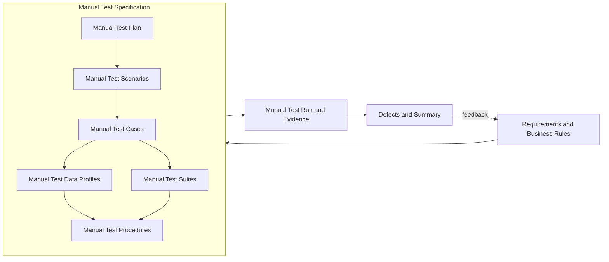

# Manual QA Lifecycle

Status: Designed, not executed. No `MTC-*` case has a human execution result.

I use this specification to separate human observation from pytest automation. A tester records the actual result and evidence during execution. Automated PASS records do not count as manual PASS evidence.

## 0. Manual Test Specification

`Manual Test Specification` is the container for the plan, scenarios, suites, cases, data profiles, procedures, and traceability. It is not a separate sequential test step.

| Artifact | Canonical section／file | Status |
|---|---|---|
| Requirements and business rules | [Canonical requirements](requirements.md) and section 1 | Active |
| Shared governance | [Test Governance](test-governance.md) and section 2 | Active |
| Manual Test Plan | Section 2 | Designed |
| Manual Test Scenarios | Section 3 | Designed, 7 scenarios |
| Manual Test Suites | Section 4 | Designed, 5 suites |
| Manual Test Cases | Section 5 | Designed, 10 cases |
| Manual Test Data Profiles | Section 6 | Designed, 6 profiles |
| Requirements Traceability Matrix | Section 7 | Designed, 9 requirements mapped |
| Manual Test Procedures | Section 8 | Designed |
| Manual Test Run | Section 9 and [Manual Test Run template](../evidence/MANUAL_TEMPLATE.md) | Not executed |
| Defects and summary | Section 10 | No manual defect record |

## 1. Requirements and business rules

The manual path reuses the canonical [requirements](requirements.md) instead of creating a second requirement set.

| Requirement | Manual verification intent |
|---|---|
| REQ-SAFE-001 | Confirm public market-data hosts, no credential, and no account or trading action. |
| REQ-REST-001 | Inspect one `bookTicker` response for required fields, positive values, and `best bid <= best ask`. |
| REQ-REST-002 | Inspect a depth snapshot for update ID, both sides, positive levels, and market ordering. |
| REQ-REST-003 | Confirm one requested symbol, trading status, and core filters in `exchangeInfo`. |
| REQ-REST-004 | Preserve HTTP status, exchange code, and message for an invalid symbol. |
| REQ-WS-001 | Observe subscribe／unsubscribe acknowledgments, correlated IDs, event receipt, and bounded waits. |
| REQ-WS-002 | Inspect symbol, required fields, positive values, market ordering, and update-ID order. |
| REQ-SYNC-001 | Compare a depth snapshot with buffered events and confirm the documented overlap sequence. |
| REQ-EVID-001 | Record tester, UTC time, revision, environment, expected and actual results, status, and evidence. |

Business rules `BR-001` through `BR-006` remain authoritative. A manual run reports an external outage as Fail or Blocked and does not convert it into PASS.

## 2. Manual Test Plan

### Objective and scope

Confirm that a human tester can inspect public REST and WebSocket behavior, follow the synchronization sequence, and produce evidence that another reviewer can audit.

Included: public `exchangeInfo`, `bookTicker`, and depth REST requests; public `bookTicker` and diff-depth WebSocket streams; safety-boundary inspection; one invalid-symbol response; synchronization rehearsal; evidence review.

Excluded: authentication, balances, orders, deposits, withdrawals, KYC／AML, real funds, intentional rate-limit traffic, service disruption, production reconnect certification, and destructive schema mutation against the public service.

### Environment and entry criteria

- Record the full Git SHA, branch, UTC start time, worktree state, clients, operating system, and client versions.
- Use clients that display raw URLs, headers, JSON, frames, and timestamps.
- Use `BTCUSDT` unless the run record declares another public symbol.
- Configure no credential. Stop if a client adds an authorization header.
- Copy the [Manual Test Run template](../evidence/MANUAL_TEMPLATE.md) before execution.
- Declare control-acknowledgment, event-receive, and case timeouts. Recommended values are 10, 10, and 30 seconds; record a reason for any change.

### Test priority

The canonical definitions are in [Test Governance](test-governance.md).

| Priority | Meaning | Release treatment |
|---|---|---|
| P0 | Safety boundary or state-corruption risk | Must pass |
| P1 | Core functional, contract, synchronization, traceability, or release-evidence behavior | Must pass |
| P2 | Defensive edge behavior with bounded impact | Must pass for regression baseline |
| P3 | Informational or future coverage | Does not block unless promoted |

### Defect severity

| Severity | Impact | Release treatment |
|---|---|---|
| S0 Critical | Safety boundary breach, real-fund exposure, or unrecoverable state corruption | Stop publication and correct before any rerun |
| S1 High | Core contract or synchronization failure with no safe workaround | Block publication |
| S2 Medium | Bounded incorrect behavior, false test result, or diagnosability gap with a safe workaround | Correct or document before baseline approval |
| S3 Low | Minor documentation or low-impact usability defect | Track without blocking the baseline |

### Exit and release criteria

- Map 100% of requirements to scenarios and cases.
- Execute and pass 100% of planned P0 and P1 cases for a release recommendation.
- Provide accessible evidence for 100% of executed cases.
- Keep zero open S0 or S1 defects.
- A required P0 or P1 Fail makes the run Failed and blocks release.
- With no required Fail, a required Blocked result makes the run Blocked with no release decision.
- With no required Fail or Blocked, a required Skipped or missing result makes the run Incomplete with no release decision.
- A run is Passed only when every required P0 and P1 case passes and all other gates are met.

## 3. Manual Test Scenarios

| ID | Type | Scenario | Requirements | Boundary |
|---|---|---|---|---|
| MSCN-001 | Safety | Confirm the public-only boundary before sending requests. | REQ-SAFE-001 | Tester → client configuration → public hosts |
| MSCN-002 | Positive | Inspect public symbol metadata and top-of-book data. | REQ-REST-001, REQ-REST-003 | Tester → REST client → public REST |
| MSCN-003 | Positive | Inspect a valid depth snapshot and market ordering. | REQ-REST-002 | Tester → REST client → depth response |
| MSCN-004 | Negative | Preserve a structured invalid-symbol error. | REQ-REST-004 | Public REST → REST client → tester |
| MSCN-005 | Positive／protocol | Subscribe, inspect events, and unsubscribe with correlated IDs. | REQ-WS-001, REQ-WS-002 | Tester → WebSocket client → public stream |
| MSCN-006 | Positive／state | Align a snapshot with buffered diff-depth events. | REQ-REST-002, REQ-SYNC-001 | WebSocket buffer ↔ REST snapshot → worksheet |
| MSCN-007 | Evidence | Produce an auditable manual Test Run record. | REQ-EVID-001 | Tester → evidence record → reviewer |

### Manual negative-coverage disposition

| Risk | Current owner | Manual coverage status |
|---|---|---|
| Schema drift and malformed payloads | Automated `REST-008`, `WS-010`–`WS-012` | `EXP-001` is designed, not executed. |
| Disconnect and resynchronization | Automated timeout and synchronization cases | `EXP-002` is designed, not executed. |
| Wrong or delayed acknowledgment | Automated `WS-006`, `WS-007`, `WS-009` | Manual cases cover the valid protocol path; no negative manual PASS is claimed. |
| Rate limit, DNS, and network-policy failures | Automated `REST-009` plus error-preservation contracts | `EXP-004` is designed, not executed. |

The [Exploratory Test Charters](exploratory-charters.md) own planned human negative exploration. The current manual specification does not claim those charters passed.

## 4. Manual Test Suites

| Suite | Purpose | Cases | Trigger | Setup／teardown |
|---|---|---|---|---|
| MSUITE-SMOKE | Confirm safe connectivity and core public responses. | MTC-SAFE-001, MTC-REST-001–MTC-REST-003 | Before a wider session | Clear history; configure no credential; close sessions after capture |
| MSUITE-REST | Inspect success and error contracts. | MTC-REST-001–MTC-REST-004 | Release review | Use a new request tab per case; save raw response |
| MSUITE-WS | Inspect control frames and market events. | MTC-WS-001–MTC-WS-003 | Release review | Open a new connection; unsubscribe and close it after capture |
| MSUITE-SYNC | Rehearse the local-book overlap procedure. | MTC-SYNC-001 | Synchronization review | Start a new worksheet; retain only recorded evidence |
| MSUITE-EVIDENCE | Review execution completeness. | MTC-EVID-001 | End of session | Compare run record, artifacts, defects, and limitations |

Cases remain independent except `MTC-WS-002` and `MTC-WS-003`, which reuse the connection opened by `MTC-WS-001` in one recorded session.

## 5. Manual Test Cases

| ID | Title／component | Priority | Requirement／scenario | Preconditions／data | Manual steps | Expected result | Required evidence |
|---|---|---|---|---|---|---|---|
| MTC-SAFE-001 | Public-scope safety gate | P0 | REQ-SAFE-001／MSCN-001 | API and WebSocket clients; MDATA-PUBLIC-SCOPE | 1. Inspect base URLs. 2. Inspect headers, variables, and authentication settings. 3. Confirm no account or order path. | Hosts match the public allowlist. No credential, authorization header, account endpoint, or trading action exists. | Configuration screenshot or exported request with sensitive panes closed |
| MTC-REST-001 | Exchange metadata | P1 | REQ-REST-003／MSCN-002 | MDATA-BTCUSDT | 1. Send `exchangeInfo`. 2. Record status and JSON. 3. Locate symbol, status, and filters. | HTTP 200; one `BTCUSDT`; status `TRADING`; `PRICE_FILTER` and `LOT_SIZE` present. | URL, status, and response body |
| MTC-REST-002 | Top of book | P1 | REQ-REST-001／MSCN-002 | MDATA-BTCUSDT | 1. Send `bookTicker`. 2. Record bid／ask fields. 3. Compare numeric values. | HTTP 200; symbol matches; values are positive; bid does not exceed ask. | URL, response body, and comparison note |
| MTC-REST-003 | Depth snapshot | P1 | REQ-REST-002／MSCN-003 | MDATA-BTCUSDT; limit 100 | 1. Send depth request. 2. Record `lastUpdateId`. 3. Inspect both sides and first levels. | HTTP 200; positive update ID; non-empty sides; positive levels; best bid does not exceed best ask. | URL, response body, and first-level calculation |
| MTC-REST-004 | Invalid symbol | P1 | REQ-REST-004／MSCN-004 | MDATA-INVALID-SYMBOL | 1. Request `NOT_A_SYMBOL`. 2. Record status and body. | HTTP 400; code `-1121`; message identifies an invalid symbol. | URL, status, and error body |
| MTC-WS-001 | Subscribe acknowledgment | P1 | REQ-WS-001／MSCN-005 | MDATA-WS-BTCUSDT | 1. Connect to the public host. 2. Send subscribe ID 1. 3. Record acknowledgment. | Connection opens; acknowledgment has `result: null` and `id: 1`. | URL, sent frame, acknowledgment, UTC timestamps |
| MTC-WS-002 | Market event inspection | P1 | REQ-WS-002／MSCN-005 | Active MTC-WS-001 subscription | 1. Capture three events. 2. Compare symbols, fields, values, and update IDs. | All use `BTCUSDT`; required fields exist; values are positive; bid does not exceed ask; update IDs do not decrease. | Three frames and comparison worksheet |
| MTC-WS-003 | Unsubscribe acknowledgment | P1 | REQ-WS-001／MSCN-005 | Active subscription; declared acknowledgment timeout | 1. Send unsubscribe ID 2. 2. Wait within the declared acknowledgment timeout. 3. Record frames until the matching acknowledgment. | A matching `id: 2` acknowledgment arrives. An in-flight market event does not count as acknowledgment. | Sent and received frames, acknowledgment, elapsed time |
| MTC-SYNC-001 | Snapshot and stream alignment | P0 | REQ-REST-002, REQ-SYNC-001／MSCN-006 | MDATA-DEPTH-SYNC; REST and WebSocket clients | 1. Buffer diff-depth events. 2. Request snapshot. 3. Discard stale events. 4. Find the overlap event. 5. Apply three continuous events. 6. Inspect top of book. | Ranges overlap without a gap; zero quantity removes a level; final book has both sides and is not crossed. | Snapshot, frames, worksheet, final bid／ask |
| MTC-EVID-001 | Run evidence review | P1 | REQ-EVID-001／MSCN-007 | MDATA-MANUAL-RUN; completed session | 1. Compare run record with cases. 2. Open each evidence path. 3. Review defects, retries, warnings, and limitations. | Each executed case has expected and actual results, status, accessible evidence, and retry／cleanup records. Missing required evidence blocks PASS. | Completed run record and reviewer sign-off |

## 6. Manual Test Data Profiles

| Profile | Type | Values／rule | Isolation |
|---|---|---|---|
| MDATA-PUBLIC-SCOPE | Static configuration | REST `https://data-api.binance.vision`; WebSocket `wss://data-stream.binance.vision`; no credential | Export a redacted configuration per run |
| MDATA-BTCUSDT | Dynamic live | `BTCUSDT`; current values; depth limit 100 | Record values and UTC time; do not reuse expected prices |
| MDATA-INVALID-SYMBOL | Static invalid | `NOT_A_SYMBOL` | Use one request; do not loop traffic |
| MDATA-WS-BTCUSDT | Dynamic live protocol | `btcusdt@bookTicker`; IDs 1 and 2; three events | Use a new connection per run |
| MDATA-DEPTH-SYNC | Dynamic live sequence | `btcusdt@depth@100ms`; snapshot limit 100; at least three continuous events | Use a new buffer and worksheet per case |
| MDATA-MANUAL-RUN | Static record schema | Revision, environment, timeouts, results, artifacts, hashes, defects, retries, warnings, cleanup | Create `evidence/manual/<run-id>/`; never reuse another run record |

## 7. Manual Requirements Traceability Matrix

| Requirement | Scenario | Cases | Suites | Data profiles |
|---|---|---|---|---|
| REQ-SAFE-001 | MSCN-001 | MTC-SAFE-001 | MSUITE-SMOKE | MDATA-PUBLIC-SCOPE |
| REQ-REST-001 | MSCN-002 | MTC-REST-002 | MSUITE-SMOKE, MSUITE-REST | MDATA-BTCUSDT |
| REQ-REST-002 | MSCN-003, MSCN-006 | MTC-REST-003, MTC-SYNC-001 | MSUITE-SMOKE, MSUITE-REST, MSUITE-SYNC | MDATA-BTCUSDT, MDATA-DEPTH-SYNC |
| REQ-REST-003 | MSCN-002 | MTC-REST-001 | MSUITE-SMOKE, MSUITE-REST | MDATA-BTCUSDT |
| REQ-REST-004 | MSCN-004 | MTC-REST-004 | MSUITE-REST | MDATA-INVALID-SYMBOL |
| REQ-WS-001 | MSCN-005 | MTC-WS-001, MTC-WS-003 | MSUITE-WS | MDATA-WS-BTCUSDT |
| REQ-WS-002 | MSCN-005 | MTC-WS-002 | MSUITE-WS | MDATA-WS-BTCUSDT |
| REQ-SYNC-001 | MSCN-006 | MTC-SYNC-001 | MSUITE-SYNC | MDATA-DEPTH-SYNC |
| REQ-EVID-001 | MSCN-007 | MTC-EVID-001 | MSUITE-EVIDENCE | MDATA-MANUAL-RUN |

## 8. Manual Test Procedures

1. Copy the run template into `evidence/manual/<run-id>/README.md` and complete identity, environment, scope, and timeout fields.
2. Execute cases in the selected suite order. Record the expected result before the action and the actual result after observation.
3. Assign each case `Pass`, `Fail`, `Blocked`, or `Skipped`. Do not infer PASS from another case or an automated run.
4. Store artifacts under the run directory. Record the relative path, SHA-256 when available, and accessibility check.
5. Record every retry as a new attempt and preserve the original result. Assertions and contract failures receive no retry.
6. Link defects to requirement, scenario, case, run, and evidence. Apply the shared severity and lifecycle rules.
7. Perform teardown, record cleanup, calculate the run status, and state the release recommendation or no-decision reason.

## 9. Manual Test Run and evidence

Case statuses are `Pass | Fail | Blocked | Skipped`. Run statuses are `Planned | Passed | Failed | Blocked | Incomplete`. The [Test Governance](test-governance.md) defines classification order, timeout, retry, evidence, and release rules.

No manual run has been executed. The [Manual Test Run template](../evidence/MANUAL_TEMPLATE.md) requires expected and actual results, evidence inventory, availability or hash, retries, defects, cleanup, blockers, and coverage gaps.

## 10. Defects and summary

Use `New -> Confirmed -> In Progress -> Ready for Retest -> Closed`; use `Reopened` after a failed retest. `Deferred` is limited to S2 or S3 with a rationale, owner, and review date.

Current manual result: no execution, no manual PASS claim, and no manual defect record. The automated result remains separate in the [Test Summary Report](test-summary-report.md).
