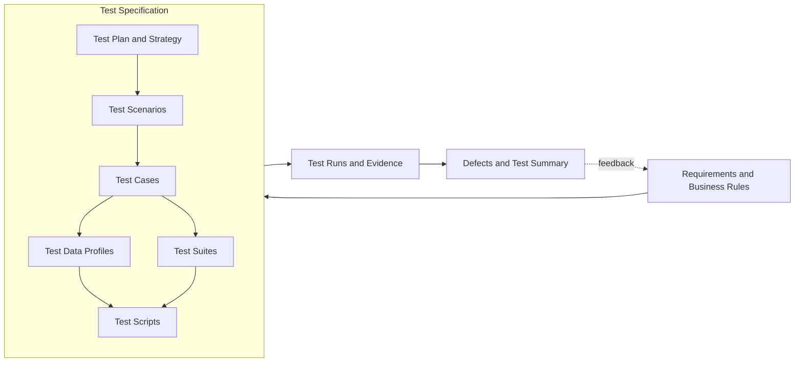

# Test Specification

Status: Local governance candidate based on public head `8fd5081`. Public CI for this candidate and current-head live automation are pending.

This specification is the container and index for the project's QA design artifacts. It is not a sequential lifecycle step.

| Lifecycle artifact | Canonical document／path |
|---|---|
| Requirements and business rules | [requirements.md](requirements.md) |
| Acceptance and completion gate | [acceptance-criteria.md](acceptance-criteria.md) |
| Shared governance | [test-governance.md](test-governance.md) |
| Test Plan and strategy | [test-plan.md](test-plan.md) |
| Test Scenarios | [test-scenarios.md](test-scenarios.md) |
| Test Cases | [test-cases.md](test-cases.md) |
| Test Data Profiles | [test-data-profiles.md](test-data-profiles.md) |
| Test Suites | [test-suites.md](test-suites.md) |
| Test Scripts and assertions | [automation-map.md](automation-map.md), `tests/` |
| Requirements traceability | [traceability-matrix.md](traceability-matrix.md) |
| Manual QA lifecycle | [manual-testing-lifecycle.md](manual-testing-lifecycle.md) |
| Test Runs and artifacts | [`evidence/`](../evidence/README.md) |
| Exploratory test charters | [exploratory-charters.md](exploratory-charters.md) |
| Defect history and release conclusion | [test-summary-report.md](test-summary-report.md) |
| Risks and exclusions | [risk-analysis.md](risk-analysis.md), [limitations.md](limitations.md) |

## Identification conventions

- Requirements: `REQ-*`
- Business rules: `BR-*`
- Scenarios: `SCN-*`
- Test Cases: `OB-*`, `REST-*`, `WS-*`, `DOC-*`, `LIVE-*`
- Manual Test Cases: `MTC-*`
- Test Data Profiles: `DATA-*`
- Test Suites: `SUITE-*`
- Defects: `DEF-*`
- Exploratory charters: `EXP-*`

No Jira integration exists for this portfolio project. Project-local IDs provide stable traceability without implying an external ticket record.

Human exploratory testing has not been executed. The charter document records planned sessions without claiming test evidence.

The manual lifecycle is also Designed, not executed. Its `MTC-*` cases do not contribute to automated pytest counts.
